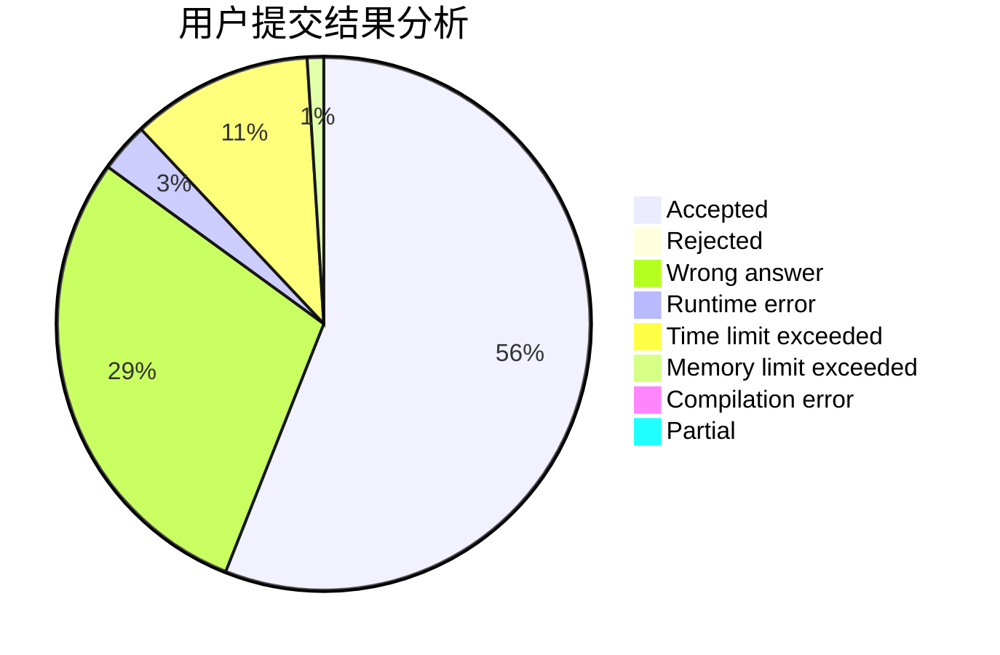
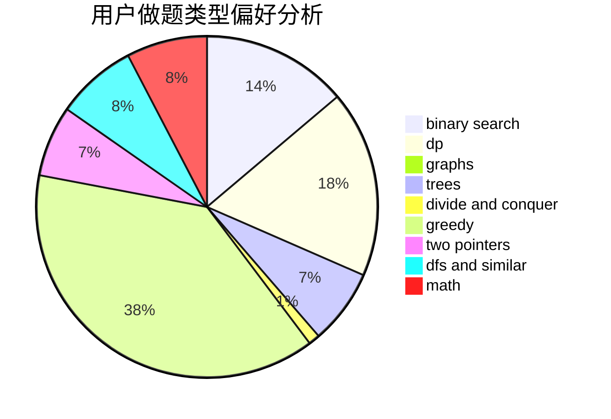

# cjlworld

<!-- tabs:start -->

#### **用户提交结果分析**

#### **用户做题类型偏好分析**

<!-- tabs:end -->
# 推荐题目
[449D](https://codeforces.com/contest/449/problem/D)
[193B](https://codeforces.com/contest/193/problem/B)
[555C](https://codeforces.com/contest/555/problem/C)
[766E](https://codeforces.com/contest/766/problem/E)
[1286A](https://codeforces.com/contest/1286/problem/A)
[1276D](https://codeforces.com/contest/1276/problem/D)
[39C](https://codeforces.com/contest/39/problem/C)
[893A](https://codeforces.com/contest/893/problem/A)
[1242E](https://codeforces.com/contest/1242/problem/E)
[22E](https://codeforces.com/contest/22/problem/E)
