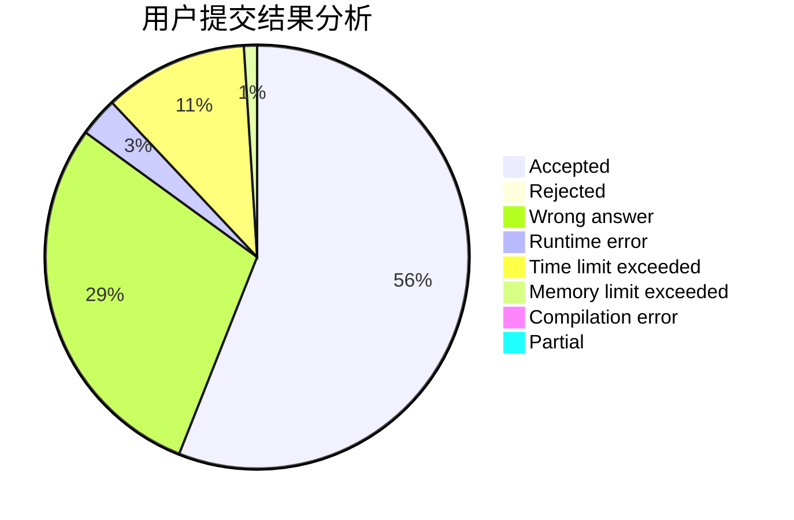
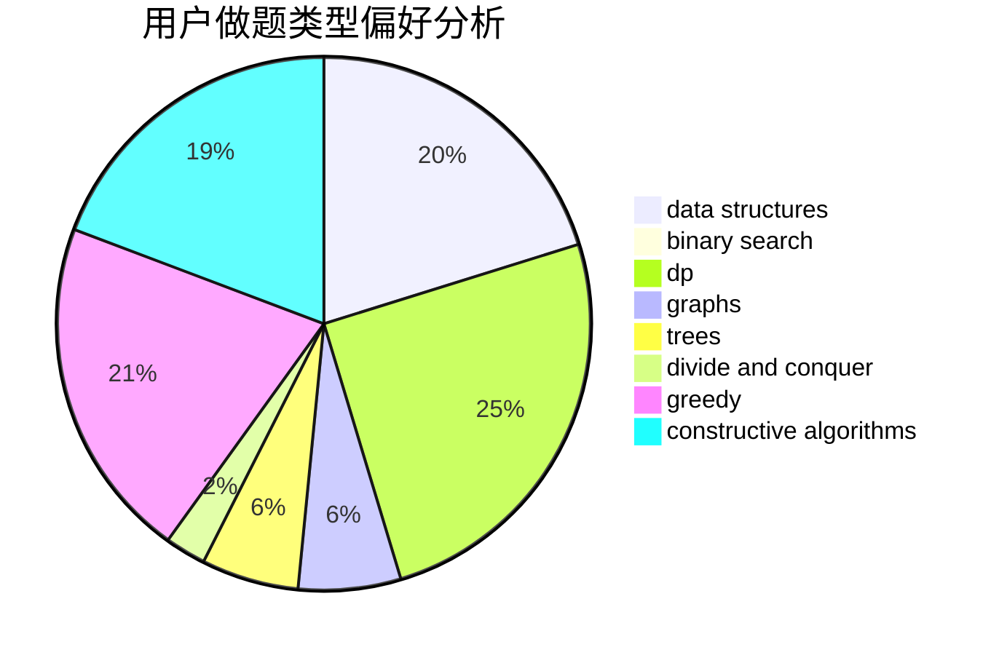
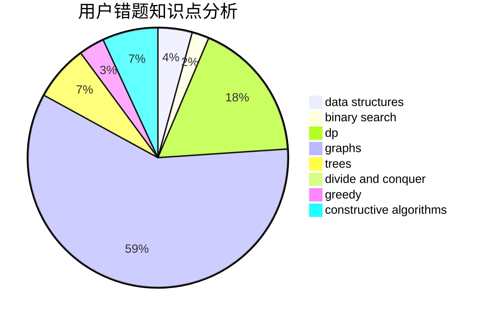

# cjlworld

<!-- tabs:start -->

#### **用户提交结果分析**

#### **用户做题类型偏好分析**

#### **用户错题知识点分析**

<!-- tabs:end -->
# 推荐题目
[426B](https://codeforces.com/contest/426/problem/B)		implementation		  
[166E](https://codeforces.com/contest/166/problem/E)		dp,
                        math,
                        matrices		  
[533E](https://codeforces.com/contest/533/problem/E)		constructive algorithms,
                        dp,
                        greedy,
                        hashing,
                        strings,
                        two pointers		  
[747B](https://codeforces.com/contest/747/problem/B)		implementation,
                        strings		  
[1280A](https://codeforces.com/contest/1280/problem/A)		implementation,
                        math		  
[1267I](https://codeforces.com/contest/1267/problem/I)		brute force,
                        constructive algorithms,
                        implementation,
                        interactive,
                        sortings		  
[369A](https://codeforces.com/contest/369/problem/A)		greedy,
                        implementation		  
[871D](https://codeforces.com/contest/871/problem/D)		dsu,graphs,sortings,trees		  
[1237G](https://codeforces.com/contest/1237/problem/G)		data structures,
                        dp,
                        greedy		  
[208C](https://codeforces.com/contest/208/problem/C)		dp,
                        graphs,
                        shortest paths		  
