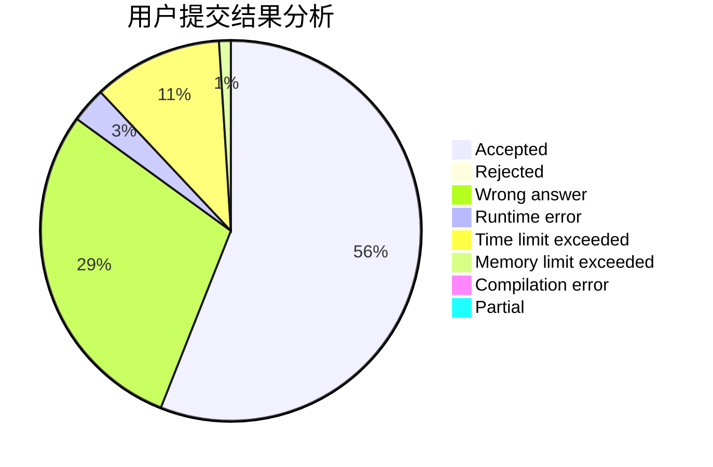
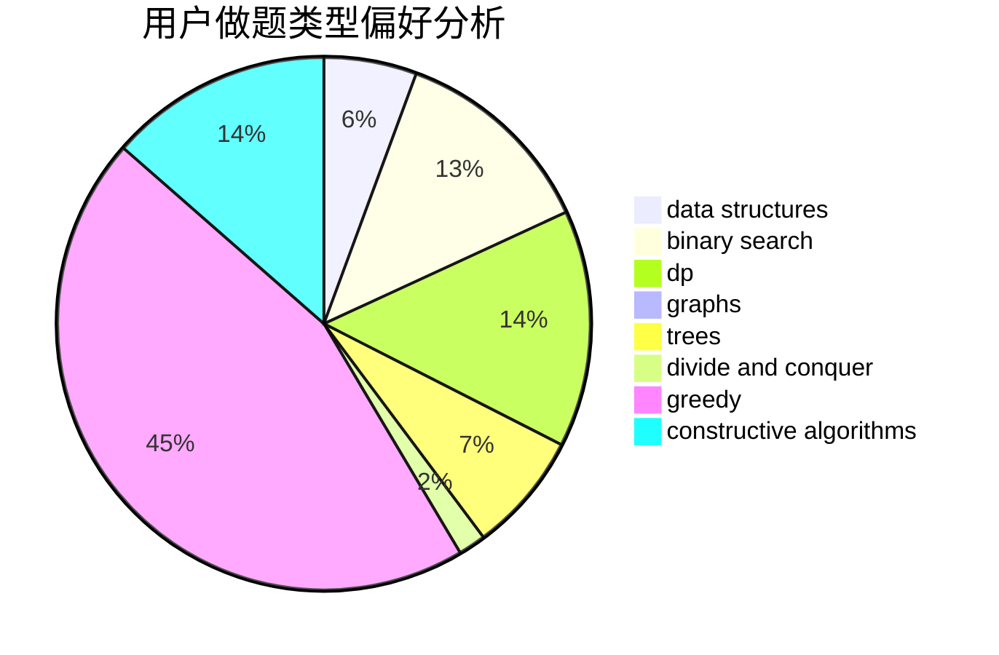
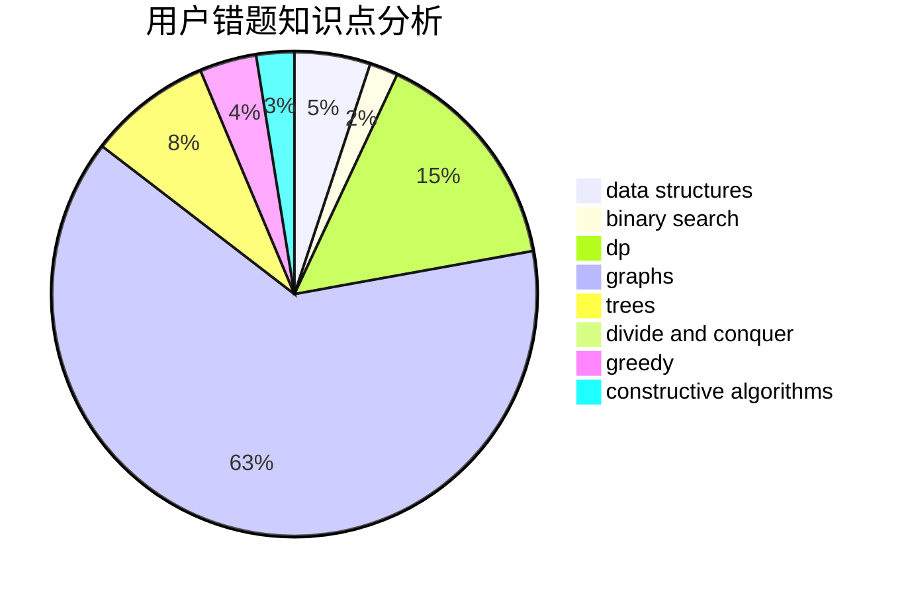

# cjlworld

<!-- tabs:start -->

#### **用户提交结果分析**

#### **用户做题类型偏好分析**

#### **用户错题知识点分析**

<!-- tabs:end -->
# 推荐题目
[449D](https://codeforces.com/contest/449/problem/D)		bitmasks,
                        combinatorics,
                        dp		  
[193B](https://codeforces.com/contest/193/problem/B)		brute force		  
[555C](https://codeforces.com/contest/555/problem/C)		data structures		  
[766E](https://codeforces.com/contest/766/problem/E)		bitmasks,
                        constructive algorithms,
                        data structures,
                        dfs and similar,
                        dp,
                        math,
                        trees		  
[1286A](https://codeforces.com/contest/1286/problem/A)		dp,
                        greedy,
                        sortings		  
[1276D](https://codeforces.com/contest/1276/problem/D)		dp,
                        trees		  
[39C](https://codeforces.com/contest/39/problem/C)		dp,
                        sortings		  
[893A](https://codeforces.com/contest/893/problem/A)		implementation		  
[1242E](https://codeforces.com/contest/1242/problem/E)		constructive algorithms,
                        graphs		  
[22E](https://codeforces.com/contest/22/problem/E)		dfs and similar,
                        graphs,
                        trees		  
