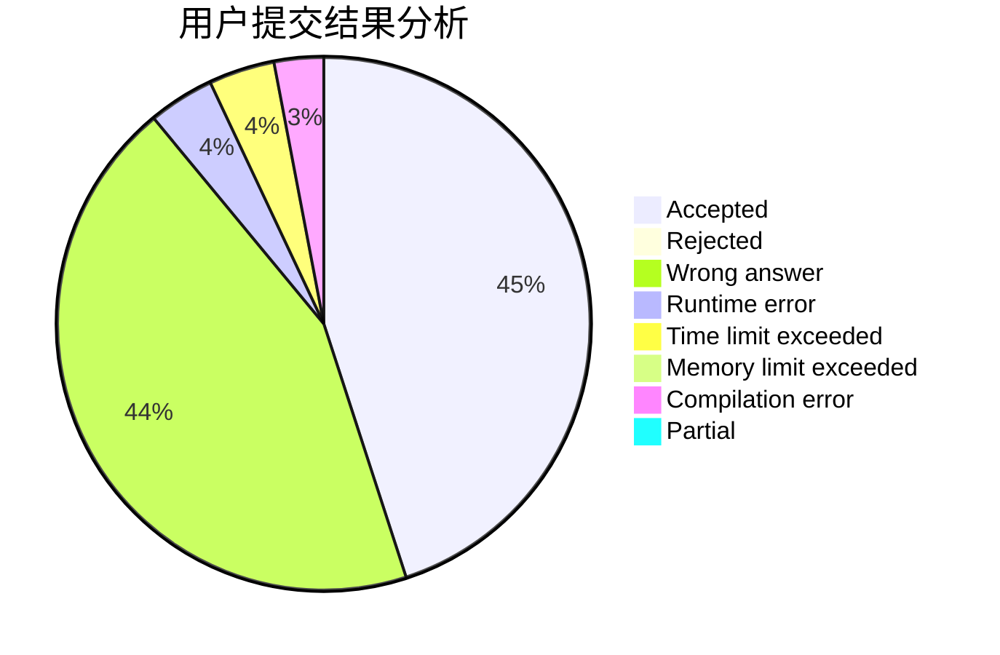
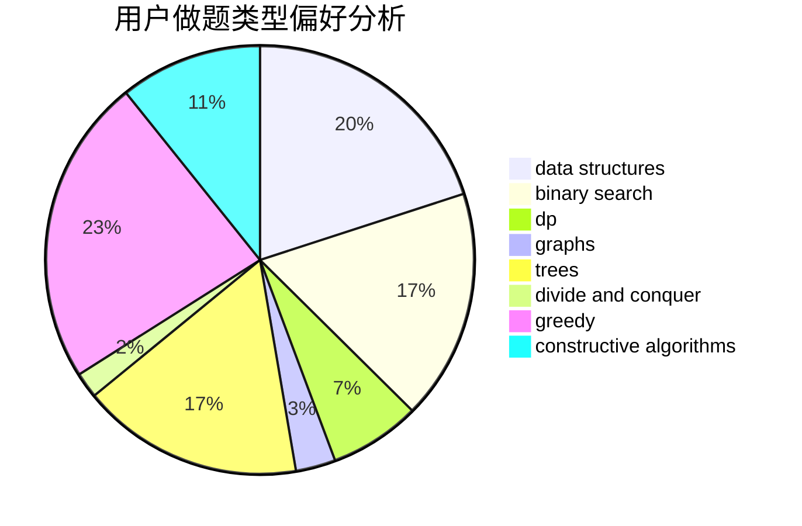
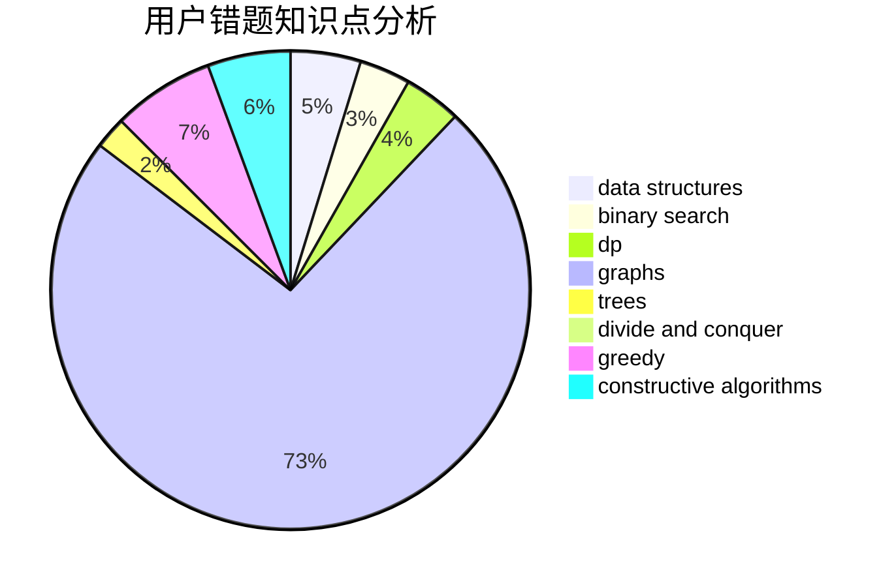

# cjrzn
<!-- tabs:start -->
#### **用户提交结果分析**

#### **用户做题类型偏好分析**

#### **用户错题知识点分析**

<!-- tabs:end -->
# 推荐题目
[FashionabLee](http://codeforces.com/problemset/problem/1369/A)		geometry,
                        math		  
[Friends](http://codeforces.com/problemset/problem/241/B)		binary search,
                        bitmasks,
                        data structures,
                        math		  
[Valued Keys](http://codeforces.com/problemset/problem/801/B)		constructive algorithms,
                        greedy,
                        strings		  
[Relatively Prime Powers](http://codeforces.com/problemset/problem/1036/F)		combinatorics,
                        math,
                        number theory		  
[Ilya and Two Numbers](http://codeforces.com/problemset/problem/313/E)		constructive algorithms,
                        data structures,
                        dsu,
                        greedy		  
[Orientation of Edges](http://codeforces.com/problemset/problem/883/G)		dfs and similar,
                        graphs		  
[Irrigation](http://codeforces.com/problemset/problem/1181/D)		binary search,
                        data structures,
                        implementation,
                        sortings,
                        trees,
                        two pointers		  
[Little Pony and Elements of Harmony](http://codeforces.com/problemset/problem/453/D)		dp,
                        matrices		  
[Cat Party (Easy Edition)](http://codeforces.com/problemset/problem/1163/B1)		data structures,
                        implementation		  
[Ant colony](http://codeforces.com/problemset/problem/474/F)		data structures,
                        math,
                        number theory		  
<!-- tabs:start -->
#### **data structures**
[FashionabLee](http://codeforces.com/problemset/problem/241/B)		binary search,
                        bitmasks,
                        data structures,
                        math		  
[Friends](http://codeforces.com/problemset/problem/313/E)		constructive algorithms,
                        data structures,
                        dsu,
                        greedy		  
[Valued Keys](http://codeforces.com/problemset/problem/1181/D)		binary search,
                        data structures,
                        implementation,
                        sortings,
                        trees,
                        two pointers		  
[Relatively Prime Powers](http://codeforces.com/problemset/problem/1163/B1)		data structures,
                        implementation		  
[Ilya and Two Numbers](http://codeforces.com/problemset/problem/474/F)		data structures,
                        math,
                        number theory		  
[Orientation of Edges](https://codeforces.com/contest/1459/problem/F)		data structures,
                        graphs,
                        greedy		  
[Irrigation](http://codeforces.com/problemset/problem/1286/D)		data structures,
                        math,
                        matrices,
                        probabilities		  
[Little Pony and Elements of Harmony](http://codeforces.com/problemset/problem/786/D)		data structures,
                        dfs and similar,
                        hashing,
                        strings,
                        trees		  
[Cat Party (Easy Edition)](http://codeforces.com/problemset/problem/1349/A)		data structures,
                        math,
                        number theory		  
[Ant colony](http://codeforces.com/problemset/problem/1492/C)		binary search,
                        data structures,
                        dp,
                        greedy,
                        two pointers		  
#### **binary search**
[FashionabLee](http://codeforces.com/problemset/problem/241/B)		binary search,
                        bitmasks,
                        data structures,
                        math		  
[Friends](http://codeforces.com/problemset/problem/1181/D)		binary search,
                        data structures,
                        implementation,
                        sortings,
                        trees,
                        two pointers		  
[Valued Keys](http://codeforces.com/problemset/problem/85/E)		binary search,
                        dsu,
                        geometry,
                        graphs,
                        sortings		  
[Relatively Prime Powers](https://codeforces.com/contest/807/problem/C)		binary search,
                        math		  
[Ilya and Two Numbers](http://codeforces.com/problemset/problem/1153/E)		binary search,
                        brute force,
                        interactive		  
[Orientation of Edges](http://codeforces.com/problemset/problem/1492/C)		binary search,
                        data structures,
                        dp,
                        greedy,
                        two pointers		  
[Irrigation](http://codeforces.com/problemset/problem/1463/D)		binary search,
                        constructive algorithms,
                        greedy,
                        two pointers		  
[Little Pony and Elements of Harmony](http://codeforces.com/problemset/problem/1490/G)		binary search,
                        data structures,
                        math		  
[Cat Party (Easy Edition)](http://codeforces.com/problemset/problem/1479/D)		binary search,
                        bitmasks,
                        brute force,
                        data structures,
                        probabilities,
                        trees		  
[Ant colony](http://codeforces.com/problemset/problem/1436/E)		binary search,
                        data structures,
                        two pointers		  
#### **dp**
[FashionabLee](http://codeforces.com/problemset/problem/453/D)		dp,
                        matrices		  
[Friends](http://codeforces.com/problemset/problem/256/D)		dp		  
[Valued Keys](https://codeforces.com/contest/866/problem/E)		bitmasks,
                        brute force,
                        dp,
                        graphs		  
[Relatively Prime Powers](http://codeforces.com/problemset/problem/51/F)		dfs and similar,
                        dp,
                        graphs,
                        trees		  
[Ilya and Two Numbers](http://codeforces.com/problemset/problem/548/B)		brute force,
                        dp,
                        greedy,
                        implementation		  
[Orientation of Edges](https://codeforces.com/contest/872/problem/C)		dp,
                        greedy,
                        math,
                        number theory		  
[Irrigation](http://codeforces.com/problemset/problem/4/D)		dp,
                        sortings		  
[Little Pony and Elements of Harmony](http://codeforces.com/problemset/problem/467/D)		dfs and similar,
                        dp,
                        graphs,
                        hashing,
                        strings		  
[Cat Party (Easy Edition)](http://codeforces.com/problemset/problem/364/B)		dp,
                        greedy		  
[Ant colony](http://codeforces.com/problemset/problem/1303/E)		dp,
                        strings		  
#### **graph**
[FashionabLee](http://codeforces.com/problemset/problem/883/G)		dfs and similar,
                        graphs		  
[Friends](http://codeforces.com/problemset/problem/85/E)		binary search,
                        dsu,
                        geometry,
                        graphs,
                        sortings		  
[Valued Keys](http://codeforces.com/problemset/problem/1250/N)		dfs and similar,
                        graphs,
                        greedy		  
[Relatively Prime Powers](https://codeforces.com/contest/866/problem/E)		bitmasks,
                        brute force,
                        dp,
                        graphs		  
[Ilya and Two Numbers](http://codeforces.com/problemset/problem/51/F)		dfs and similar,
                        dp,
                        graphs,
                        trees		  
[Orientation of Edges](https://codeforces.com/contest/1459/problem/F)		data structures,
                        graphs,
                        greedy		  
[Irrigation](http://codeforces.com/problemset/problem/243/B)		graphs,
                        sortings		  
[Little Pony and Elements of Harmony](http://codeforces.com/problemset/problem/467/D)		dfs and similar,
                        dp,
                        graphs,
                        hashing,
                        strings		  
[Cat Party (Easy Edition)](http://codeforces.com/problemset/problem/1009/G)		bitmasks,
                        flows,
                        graph matchings,
                        graphs,
                        greedy		  
[Ant colony](https://codeforces.com/contest/782/problem/E)		constructive algorithms,
                        dfs and similar,
                        graphs		  
#### **trees**
[FashionabLee](http://codeforces.com/problemset/problem/1181/D)		binary search,
                        data structures,
                        implementation,
                        sortings,
                        trees,
                        two pointers		  
[Friends](http://codeforces.com/problemset/problem/51/F)		dfs and similar,
                        dp,
                        graphs,
                        trees		  
[Valued Keys](https://codeforces.com/contest/1074/problem/B)		dfs and similar,
                        interactive,
                        trees		  
[Relatively Prime Powers](http://codeforces.com/problemset/problem/786/D)		data structures,
                        dfs and similar,
                        hashing,
                        strings,
                        trees		  
[Ilya and Two Numbers](http://codeforces.com/problemset/problem/1479/D)		binary search,
                        bitmasks,
                        brute force,
                        data structures,
                        probabilities,
                        trees		  
[Orientation of Edges](http://codeforces.com/problemset/problem/1511/C)		brute force,
                        data structures,
                        implementation,
                        trees		  
[Irrigation](http://codeforces.com/problemset/problem/1499/F)		combinatorics,
                        dfs and similar,
                        dp,
                        trees		  
[Little Pony and Elements of Harmony](http://codeforces.com/problemset/problem/1491/E)		brute force,
                        dfs and similar,
                        divide and conquer,
                        number theory,
                        trees		  
[Cat Party (Easy Edition)](http://codeforces.com/problemset/problem/1466/D)		data structures,
                        greedy,
                        sortings,
                        trees		  
[Ant colony](http://codeforces.com/problemset/problem/1495/D)		combinatorics,
                        dfs and similar,
                        graphs,
                        math,
                        shortest paths,
                        trees		  
#### **divide and conquer**
[FashionabLee](http://codeforces.com/problemset/problem/1461/D)		binary search,
                        brute force,
                        data structures,
                        divide and conquer,
                        implementation,
                        sortings		  
[Friends](http://codeforces.com/problemset/problem/1466/G)		combinatorics,
                        divide and conquer,
                        hashing,
                        math,
                        string suffix structures,
                        strings		  
[Valued Keys](http://codeforces.com/problemset/problem/1490/D)		dfs and similar,
                        divide and conquer,
                        implementation		  
[Relatively Prime Powers](https://codeforces.com/contest/1483/problem/C)		data structures,
                        divide and conquer,
                        dp		  
[Ilya and Two Numbers](http://codeforces.com/problemset/problem/1491/E)		brute force,
                        dfs and similar,
                        divide and conquer,
                        number theory,
                        trees		  
[Orientation of Edges](http://codeforces.com/problemset/problem/1303/G)		data structures,
                        divide and conquer,
                        geometry,
                        trees		  
[Irrigation](http://codeforces.com/problemset/problem/1494/D)		constructive algorithms,
                        data structures,
                        dfs and similar,
                        divide and conquer,
                        dsu,
                        greedy,
                        sortings,
                        trees		  
[Little Pony and Elements of Harmony](http://codeforces.com/problemset/problem/1482/E)		data structures,
                        divide and conquer,
                        dp		  
[Cat Party (Easy Edition)](http://codeforces.com/problemset/problem/566/C)		dfs and similar,
                        divide and conquer,
                        trees		  
[Ant colony](http://codeforces.com/problemset/problem/1428/F)		binary search,
                        data structures,
                        divide and conquer,
                        dp,
                        two pointers		  
#### **greedy**
[FashionabLee](http://codeforces.com/problemset/problem/801/B)		constructive algorithms,
                        greedy,
                        strings		  
[Friends](http://codeforces.com/problemset/problem/313/E)		constructive algorithms,
                        data structures,
                        dsu,
                        greedy		  
[Valued Keys](http://codeforces.com/problemset/problem/1315/C)		greedy		  
[Relatively Prime Powers](http://codeforces.com/problemset/problem/1250/N)		dfs and similar,
                        graphs,
                        greedy		  
[Ilya and Two Numbers](http://codeforces.com/problemset/problem/548/B)		brute force,
                        dp,
                        greedy,
                        implementation		  
[Orientation of Edges](https://codeforces.com/contest/872/problem/C)		dp,
                        greedy,
                        math,
                        number theory		  
[Irrigation](https://codeforces.com/contest/1459/problem/F)		data structures,
                        graphs,
                        greedy		  
[Little Pony and Elements of Harmony](http://codeforces.com/problemset/problem/883/M)		greedy,
                        math		  
[Cat Party (Easy Edition)](http://codeforces.com/problemset/problem/1472/A)		greedy,
                        math		  
[Ant colony](http://codeforces.com/problemset/problem/364/B)		dp,
                        greedy		  
#### **constructive algorithms**
[FashionabLee](http://codeforces.com/problemset/problem/801/B)		constructive algorithms,
                        greedy,
                        strings		  
[Friends](http://codeforces.com/problemset/problem/313/E)		constructive algorithms,
                        data structures,
                        dsu,
                        greedy		  
[Valued Keys](http://codeforces.com/problemset/problem/711/B)		constructive algorithms,
                        implementation		  
[Relatively Prime Powers](http://codeforces.com/problemset/problem/311/A)		constructive algorithms,
                        implementation		  
[Ilya and Two Numbers](https://codeforces.com/contest/782/problem/E)		constructive algorithms,
                        dfs and similar,
                        graphs		  
[Orientation of Edges](http://codeforces.com/problemset/problem/1493/A)		constructive algorithms,
                        greedy		  
[Irrigation](http://codeforces.com/problemset/problem/1463/D)		binary search,
                        constructive algorithms,
                        greedy,
                        two pointers		  
[Little Pony and Elements of Harmony](https://codeforces.com/contest/1456/problem/B)		bitmasks,
                        brute force,
                        constructive algorithms		  
[Cat Party (Easy Edition)](http://codeforces.com/problemset/problem/1492/D)		bitmasks,
                        constructive algorithms,
                        greedy,
                        math		  
[Ant colony](https://codeforces.com/contest/1504/problem/D)		constructive algorithms,
                        games,
                        interactive		  
#### **sortings**
[FashionabLee](http://codeforces.com/problemset/problem/1181/D)		binary search,
                        data structures,
                        implementation,
                        sortings,
                        trees,
                        two pointers		  
[Friends](http://codeforces.com/problemset/problem/85/E)		binary search,
                        dsu,
                        geometry,
                        graphs,
                        sortings		  
[Valued Keys](http://codeforces.com/problemset/problem/560/A)		implementation,
                        sortings		  
[Relatively Prime Powers](http://codeforces.com/problemset/problem/599/C)		sortings		  
[Ilya and Two Numbers](http://codeforces.com/problemset/problem/4/D)		dp,
                        sortings		  
[Orientation of Edges](http://codeforces.com/problemset/problem/243/B)		graphs,
                        sortings		  
[Irrigation](https://codeforces.com/contest/1496/problem/C)		geometry,
                        greedy,
                        math,
                        sortings		  
[Little Pony and Elements of Harmony](http://codeforces.com/problemset/problem/1495/A)		geometry,
                        greedy,
                        math,
                        sortings		  
[Cat Party (Easy Edition)](http://codeforces.com/problemset/problem/1497/A)		brute force,
                        data structures,
                        greedy,
                        sortings		  
[Ant colony](http://codeforces.com/problemset/problem/1427/A)		math,
                        sortings		  
<!-- tabs:end -->
