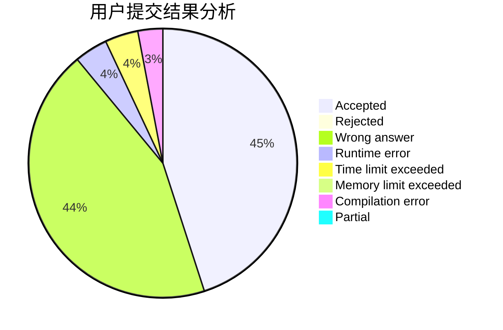
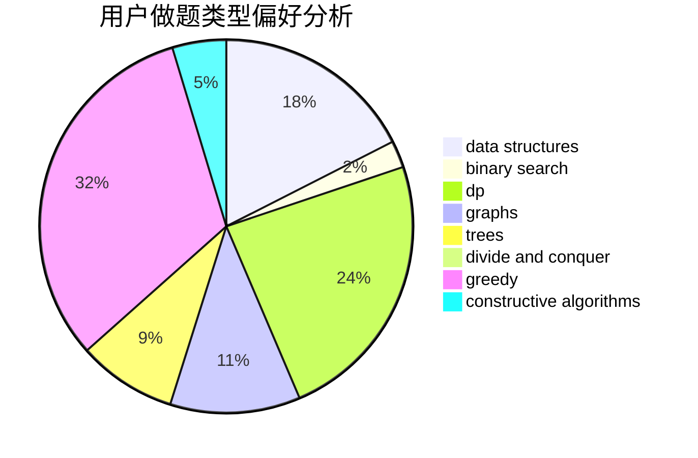
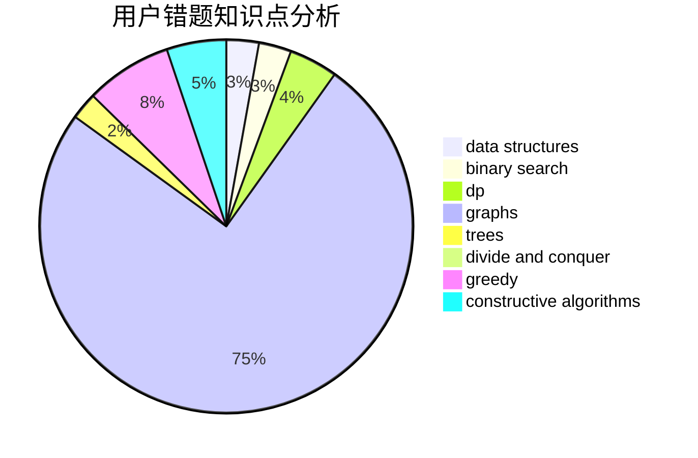

# cjrzn

<!-- tabs:start -->

#### **用户提交结果分析**

#### **用户做题类型偏好分析**

#### **用户错题知识点分析**

<!-- tabs:end -->
# 推荐题目
[1164P](https://codeforces.com/contest/1164/problem/P)		dsu,graphs,sortings,trees		  
[901A](https://codeforces.com/contest/901/problem/A)		constructive algorithms,
                        trees		  
[338D](https://codeforces.com/contest/338/problem/D)		chinese remainder theorem,
                        math,
                        number theory		  
[617B](https://codeforces.com/contest/617/problem/B)		combinatorics		  
[893E](https://codeforces.com/contest/893/problem/E)		combinatorics,
                        dp,
                        math,
                        number theory		  
[493E](https://codeforces.com/contest/493/problem/E)		math		  
[1386A](https://codeforces.com/contest/1386/problem/A)		*special problem,
                        binary search,
                        constructive algorithms,
                        interactive		  
[1311F](https://codeforces.com/contest/1311/problem/F)		data structures,
                        divide and conquer,
                        implementation,
                        sortings		  
[264C](https://codeforces.com/contest/264/problem/C)		dp		  
[1110D](https://codeforces.com/contest/1110/problem/D)		dp		  
