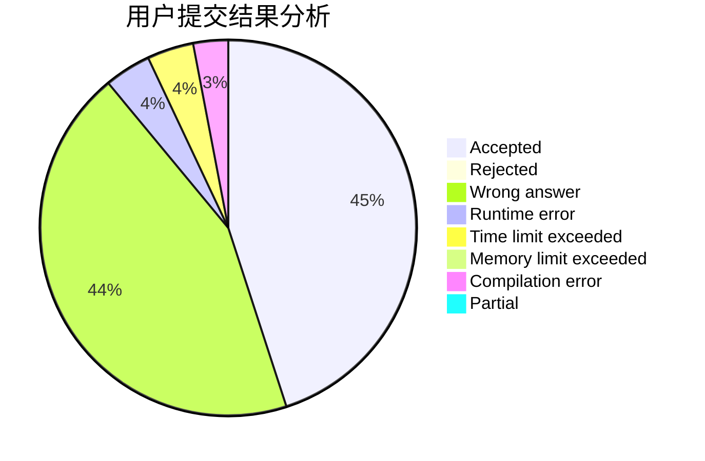
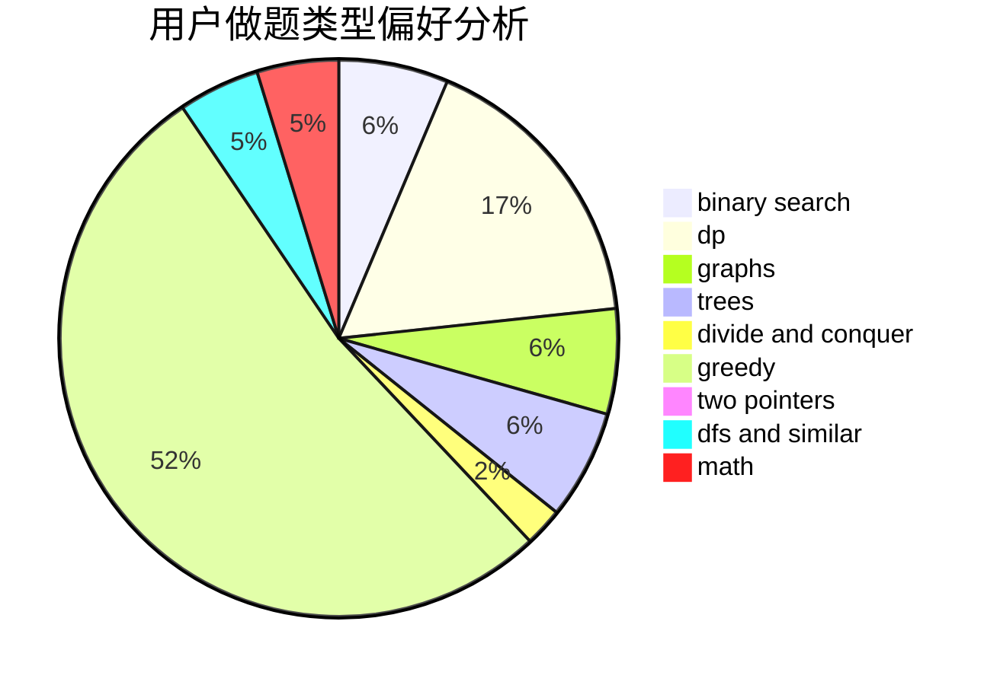

# cjrzn

<!-- tabs:start -->

#### **用户提交结果分析**

#### **用户做题类型偏好分析**

<!-- tabs:end -->
# 推荐题目
[1164P](https://codeforces.com/contest/1164/problem/P)
[901A](https://codeforces.com/contest/901/problem/A)
[338D](https://codeforces.com/contest/338/problem/D)
[617B](https://codeforces.com/contest/617/problem/B)
[893E](https://codeforces.com/contest/893/problem/E)
[493E](https://codeforces.com/contest/493/problem/E)
[1386A](https://codeforces.com/contest/1386/problem/A)
[1311F](https://codeforces.com/contest/1311/problem/F)
[264C](https://codeforces.com/contest/264/problem/C)
[1110D](https://codeforces.com/contest/1110/problem/D)
