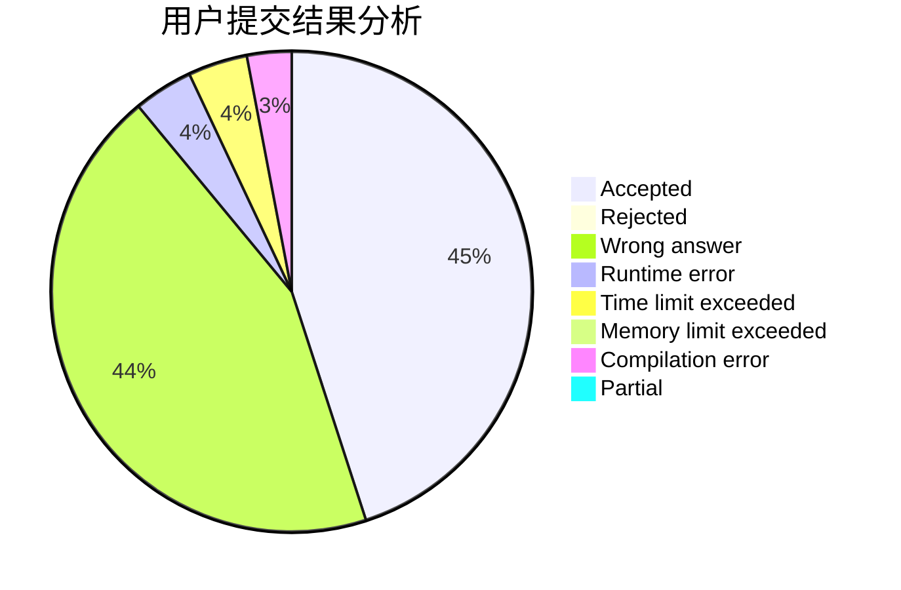
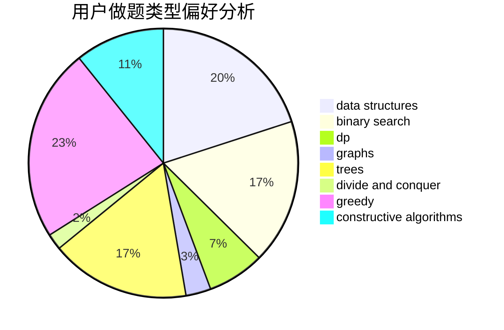
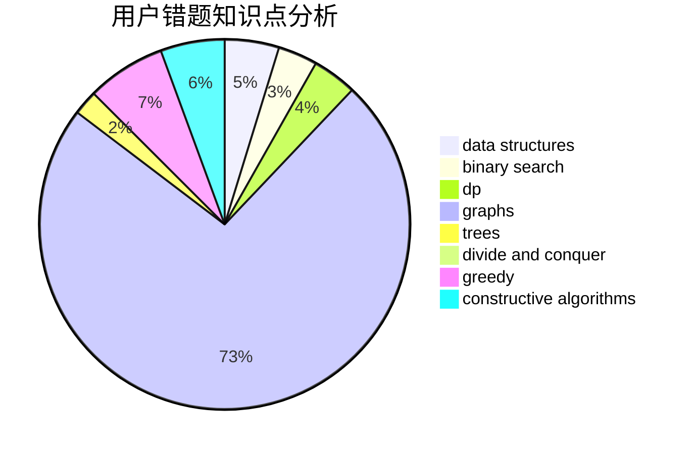

# cjrzn

<!-- tabs:start -->

#### **用户提交结果分析**

#### **用户做题类型偏好分析**

#### **用户错题知识点分析**

<!-- tabs:end -->
# 推荐题目
[1163B1](https://codeforces.com/contest/1163B/problem/1)		data structures,
                        implementation		  
[883G](https://codeforces.com/contest/883/problem/G)		dfs and similar,
                        graphs		  
[313E](https://codeforces.com/contest/313/problem/E)		constructive algorithms,
                        data structures,
                        dsu,
                        greedy		  
[599C](https://codeforces.com/contest/599/problem/C)		sortings		  
[872C](https://codeforces.com/contest/872/problem/C)		dsu,graphs,sortings,trees		  
[474F](https://codeforces.com/contest/474/problem/F)		data structures,
                        math,
                        number theory		  
[1376B4](https://codeforces.com/contest/1376B/problem/4)		dsu,graphs,sortings,trees		  
[1303B](https://codeforces.com/contest/1303/problem/B)		math		  
[243B](https://codeforces.com/contest/243/problem/B)		graphs,
                        sortings		  
[1110A](https://codeforces.com/contest/1110/problem/A)		math		  
