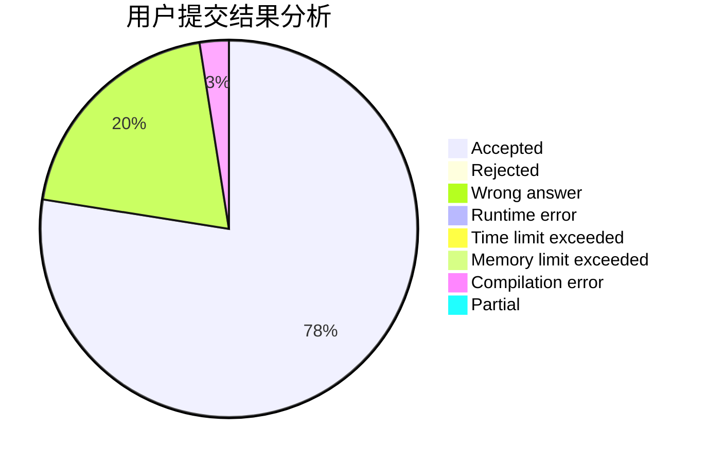
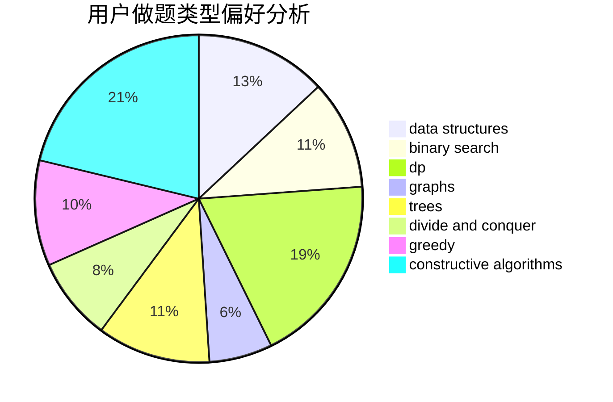
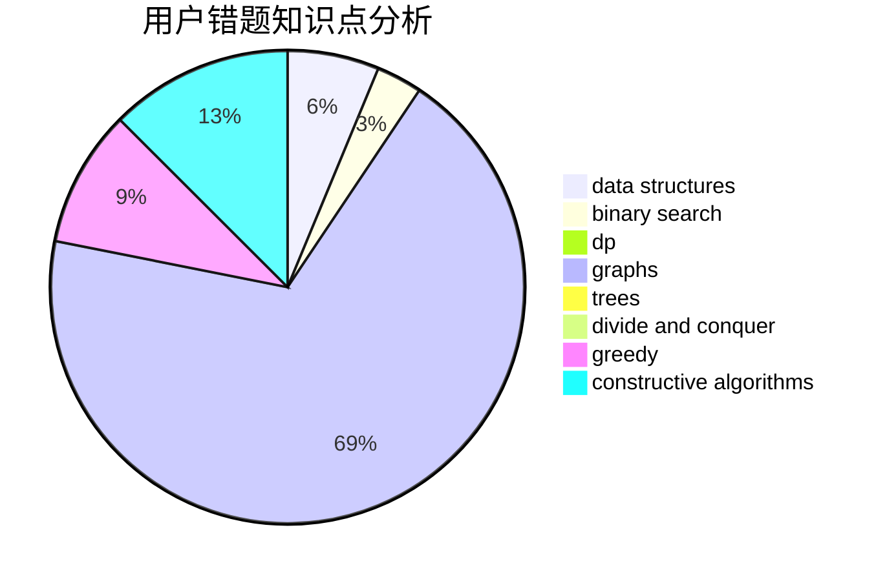

# Apojacsleam

<!-- tabs:start -->

#### **用户提交结果分析**

#### **用户做题类型偏好分析**

#### **用户错题知识点分析**

<!-- tabs:end -->
# 推荐题目
[3A](https://codeforces.com/contest/3/problem/A)		greedy,
                        shortest paths		  
[392B](https://codeforces.com/contest/392/problem/B)		dp		  
[1132G](https://codeforces.com/contest/1132/problem/G)		data structures,
                        dp,
                        trees		  
[396C](https://codeforces.com/contest/396/problem/C)		data structures,
                        graphs,
                        trees		  
[278B](https://codeforces.com/contest/278/problem/B)		brute force,
                        strings		  
[398A](https://codeforces.com/contest/398/problem/A)		constructive algorithms,
                        implementation		  
[1036E](https://codeforces.com/contest/1036/problem/E)		fft,
                        geometry,
                        number theory		  
[398C](https://codeforces.com/contest/398/problem/C)		constructive algorithms		  
[394C](https://codeforces.com/contest/394/problem/C)		constructive algorithms,
                        greedy		  
[39D](https://codeforces.com/contest/39/problem/D)		math		  
