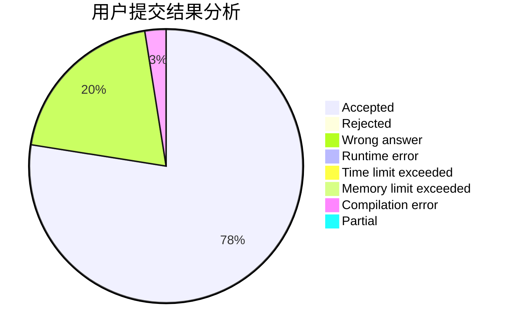
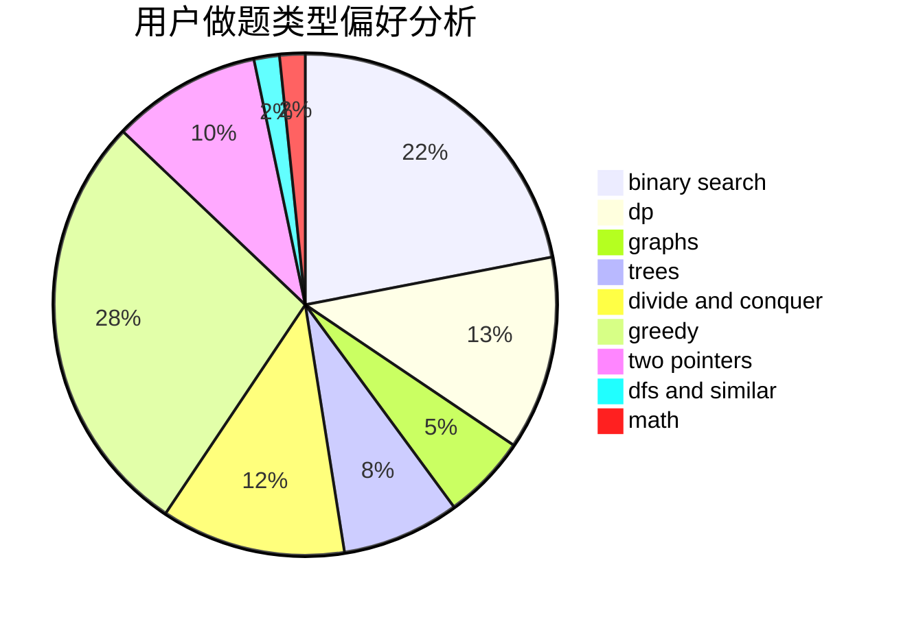

# Apojacsleam

<!-- tabs:start -->

#### **用户提交结果分析**

#### **用户做题类型偏好分析**

<!-- tabs:end -->
# 推荐题目
[3A](https://codeforces.com/contest/3/problem/A)
[392B](https://codeforces.com/contest/392/problem/B)
[1132G](https://codeforces.com/contest/1132/problem/G)
[396C](https://codeforces.com/contest/396/problem/C)
[278B](https://codeforces.com/contest/278/problem/B)
[398A](https://codeforces.com/contest/398/problem/A)
[1036E](https://codeforces.com/contest/1036/problem/E)
[398C](https://codeforces.com/contest/398/problem/C)
[394C](https://codeforces.com/contest/394/problem/C)
[39D](https://codeforces.com/contest/39/problem/D)
