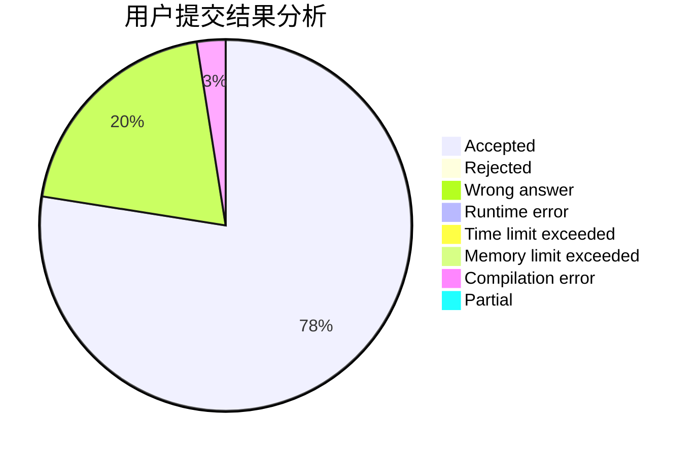
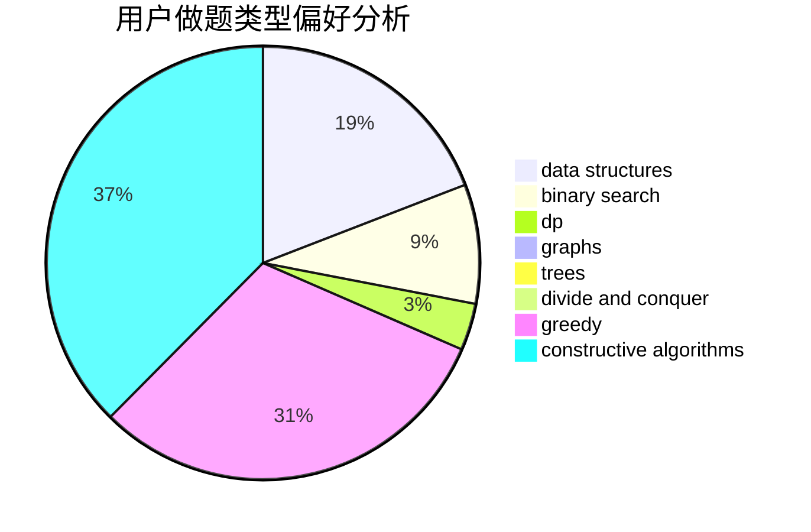
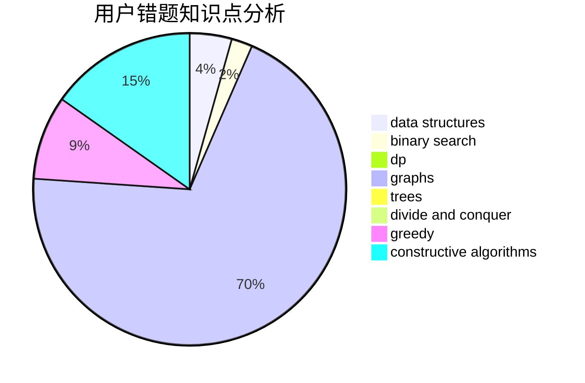

# Apojacsleam

<!-- tabs:start -->

#### **用户提交结果分析**

#### **用户做题类型偏好分析**

#### **用户错题知识点分析**

<!-- tabs:end -->
# 推荐题目
[36D](https://codeforces.com/contest/36/problem/D)		games		  
[364E](https://codeforces.com/contest/364/problem/E)		divide and conquer,
                        two pointers		  
[1131A](https://codeforces.com/contest/1131/problem/A)		math		  
[366D](https://codeforces.com/contest/366/problem/D)		binary search,
                        data structures,
                        dfs and similar,
                        dsu,
                        shortest paths,
                        two pointers		  
[260A](https://codeforces.com/contest/260/problem/A)		implementation,
                        math		  
[367B](https://codeforces.com/contest/367/problem/B)		binary search,
                        data structures		  
[1036B](https://codeforces.com/contest/1036/problem/B)		math		  
[367D](https://codeforces.com/contest/367/problem/D)		bitmasks,
                        dfs and similar		  
[366C](https://codeforces.com/contest/366/problem/C)		dp		  
[369B](https://codeforces.com/contest/369/problem/B)		constructive algorithms,
                        implementation,
                        math		  
