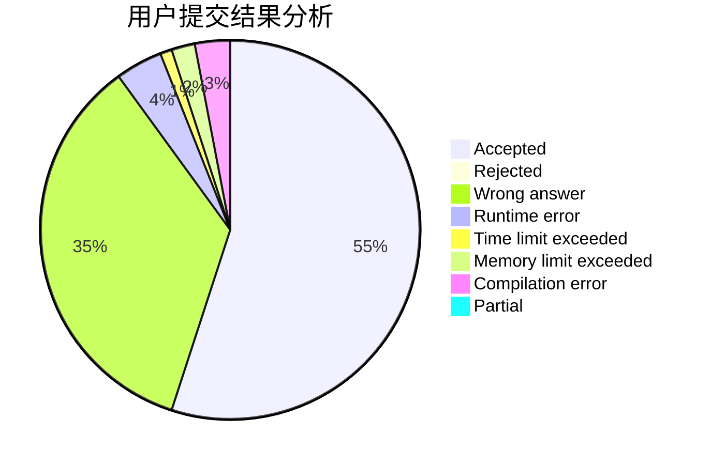
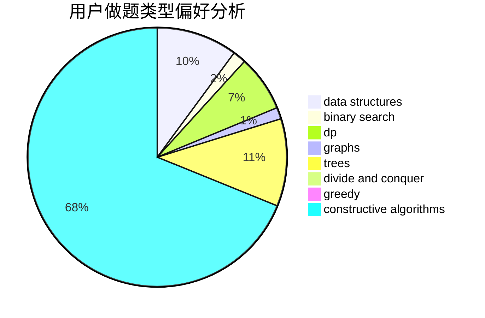
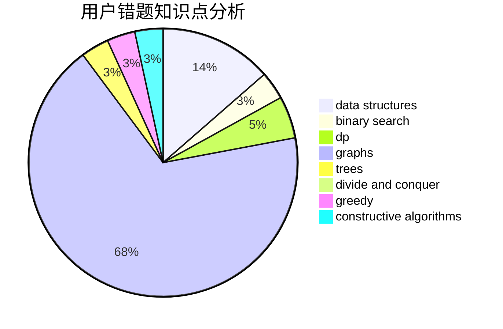

# ckxkexing

<!-- tabs:start -->

#### **用户提交结果分析**

#### **用户做题类型偏好分析**

#### **用户错题知识点分析**

<!-- tabs:end -->
# 推荐题目
[236D](https://codeforces.com/contest/236/problem/D)		dsu,graphs,sortings,trees		  
[981E](https://codeforces.com/contest/981/problem/E)		bitmasks,
                        data structures,
                        divide and conquer,
                        dp		  
[432D](https://codeforces.com/contest/432/problem/D)		dp,
                        string suffix structures,
                        strings,
                        two pointers		  
[715B](https://codeforces.com/contest/715/problem/B)		binary search,
                        constructive algorithms,
                        graphs,
                        shortest paths		  
[611D](https://codeforces.com/contest/611/problem/D)		dp,
                        hashing,
                        strings		  
[1416E](https://codeforces.com/contest/1416/problem/E)		binary search,
                        data structures,
                        dp,
                        greedy		  
[121D](https://codeforces.com/contest/121/problem/D)		binary search,
                        implementation,
                        two pointers		  
[893C](https://codeforces.com/contest/893/problem/C)		dfs and similar,
                        graphs,
                        greedy		  
[1000E](https://codeforces.com/contest/1000/problem/E)		dfs and similar,
                        graphs,
                        trees		  
[1376B2](https://codeforces.com/contest/1376B/problem/2)		dsu,graphs,sortings,trees		  
