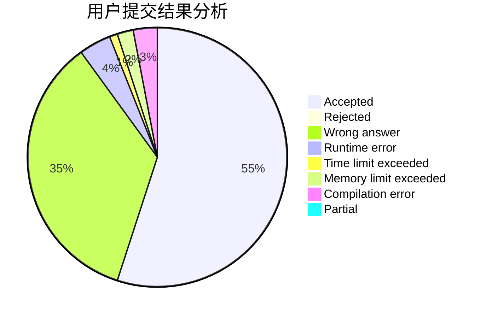
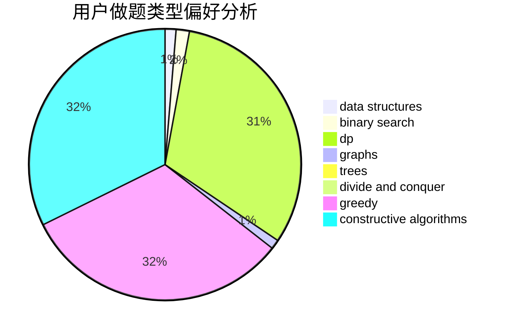
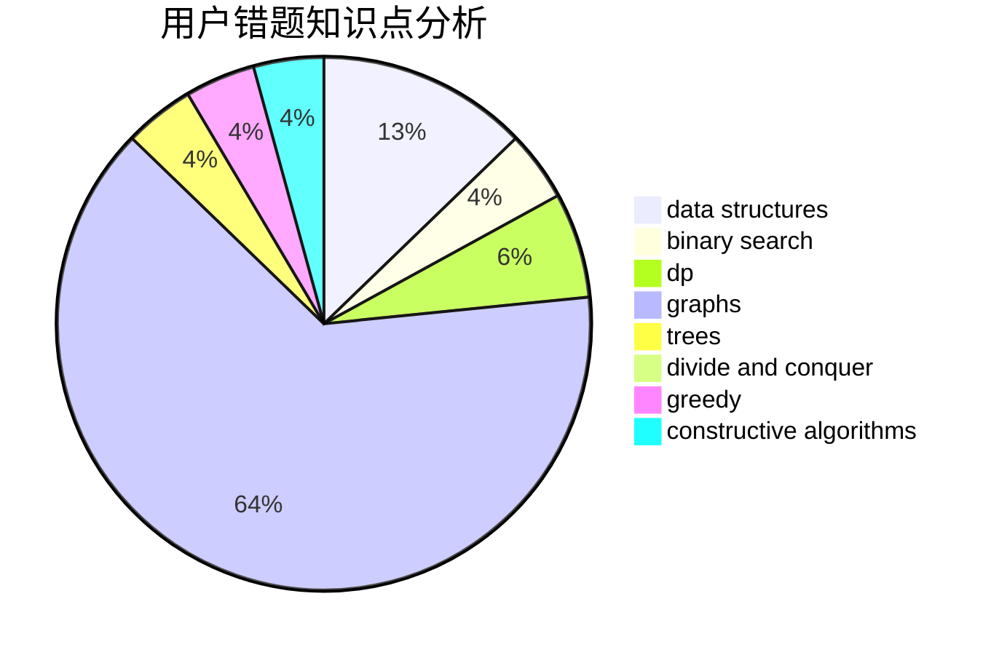

# ckxkexing

<!-- tabs:start -->

#### **用户提交结果分析**

#### **用户做题类型偏好分析**

#### **用户错题知识点分析**

<!-- tabs:end -->
# 推荐题目
[25A](https://codeforces.com/contest/25/problem/A)		brute force		  
[996F](https://codeforces.com/contest/996/problem/F)		dsu,graphs,sortings,trees		  
[453D](https://codeforces.com/contest/453/problem/D)		dp,
                        matrices		  
[733D](https://codeforces.com/contest/733/problem/D)		data structures,
                        hashing		  
[630G](https://codeforces.com/contest/630/problem/G)		combinatorics,
                        math		  
[1424B](https://codeforces.com/contest/1424/problem/B)		dsu,graphs,sortings,trees		  
[1227B](https://codeforces.com/contest/1227/problem/B)		constructive algorithms		  
[911C](https://codeforces.com/contest/911/problem/C)		brute force,
                        constructive algorithms		  
[1000E](https://codeforces.com/contest/1000/problem/E)		dfs and similar,
                        graphs,
                        trees		  
[1385F](https://codeforces.com/contest/1385/problem/F)		data structures,
                        greedy,
                        implementation,
                        trees		  
