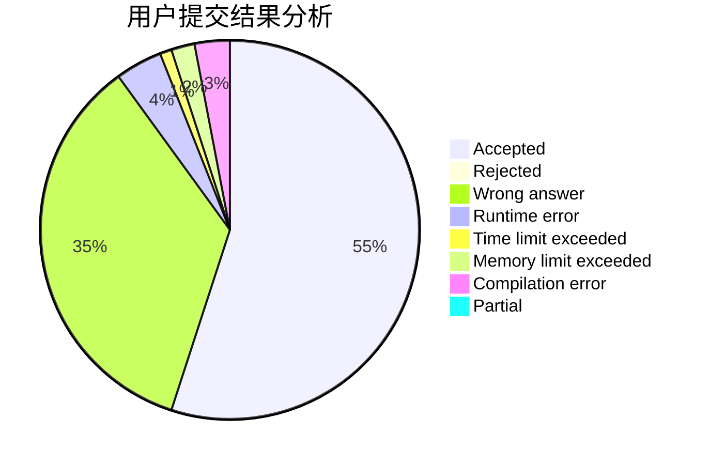
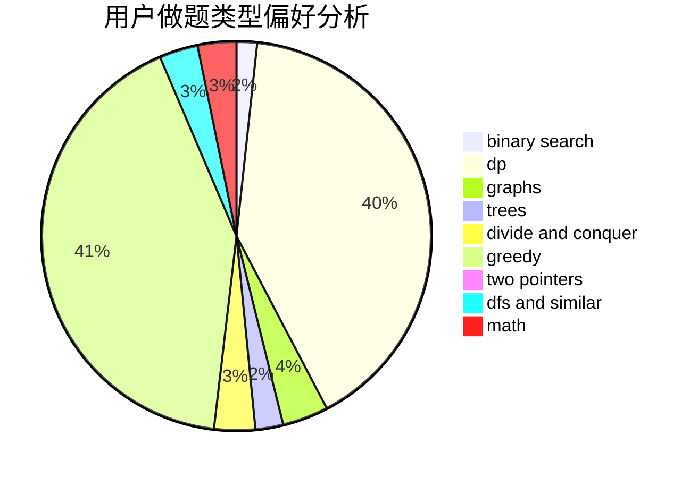

# ckxkexing

<!-- tabs:start -->

#### **用户提交结果分析**

#### **用户做题类型偏好分析**

<!-- tabs:end -->
# 推荐题目
[25A](https://codeforces.com/contest/25/problem/A)
[996F](https://codeforces.com/contest/996/problem/F)
[453D](https://codeforces.com/contest/453/problem/D)
[733D](https://codeforces.com/contest/733/problem/D)
[630G](https://codeforces.com/contest/630/problem/G)
[1424B](https://codeforces.com/contest/1424/problem/B)
[1227B](https://codeforces.com/contest/1227/problem/B)
[911C](https://codeforces.com/contest/911/problem/C)
[1000E](https://codeforces.com/contest/1000/problem/E)
[1385F](https://codeforces.com/contest/1385/problem/F)
