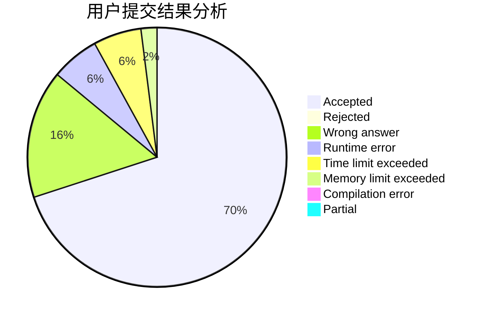
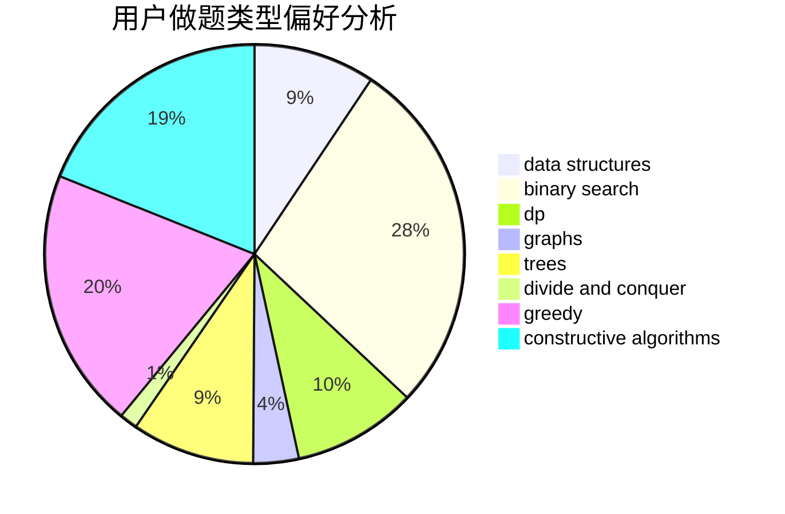
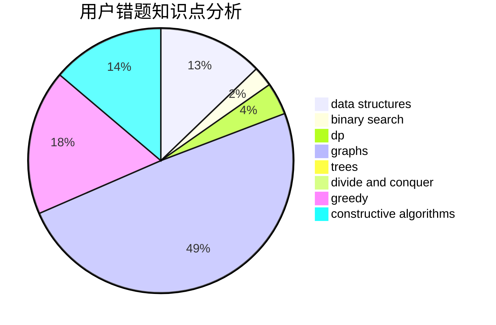

# clfzs

<!-- tabs:start -->

#### **用户提交结果分析**

#### **用户做题类型偏好分析**

#### **用户错题知识点分析**

<!-- tabs:end -->
# 推荐题目
[896A](https://codeforces.com/contest/896/problem/A)		binary search,
                        dfs and similar		  
[327A](https://codeforces.com/contest/327/problem/A)		brute force,
                        dp,
                        implementation		  
[935B](https://codeforces.com/contest/935/problem/B)		implementation		  
[560E](https://codeforces.com/contest/560/problem/E)		dsu,graphs,sortings,trees		  
[598E](https://codeforces.com/contest/598/problem/E)		brute force,
                        dp		  
[1091H](https://codeforces.com/contest/1091/problem/H)		games		  
[715A](https://codeforces.com/contest/715/problem/A)		constructive algorithms,
                        math		  
[13042](https://codeforces.com/contest/1304/problem/2)		dsu,graphs,sortings,trees		  
[886F](https://codeforces.com/contest/886/problem/F)		geometry		  
[1434E](https://codeforces.com/contest/1434/problem/E)		dsu,
                        games		  
