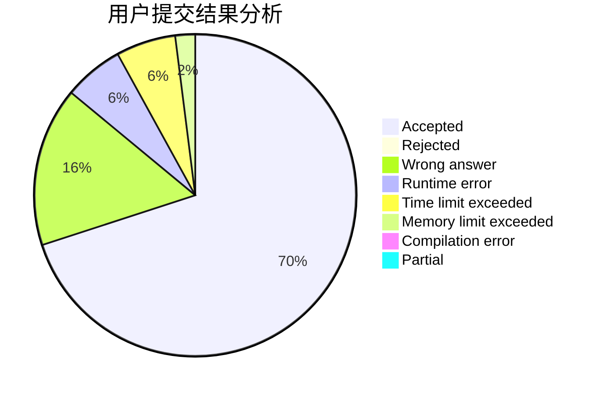
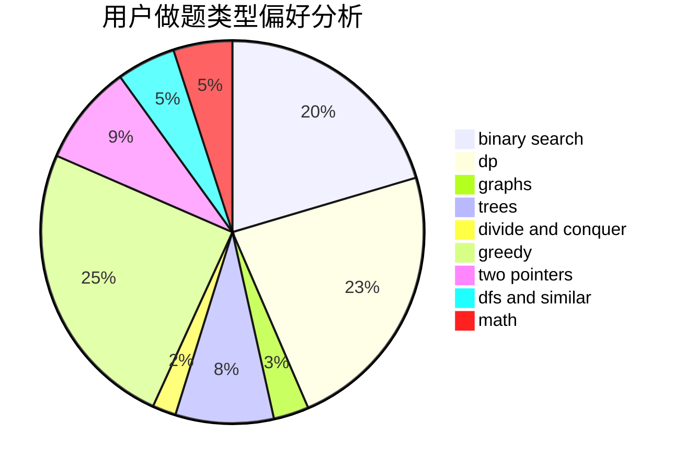

# clfzs

<!-- tabs:start -->

#### **用户提交结果分析**

#### **用户做题类型偏好分析**

<!-- tabs:end -->
# 推荐题目
[896A](https://codeforces.com/contest/896/problem/A)
[327A](https://codeforces.com/contest/327/problem/A)
[935B](https://codeforces.com/contest/935/problem/B)
[560E](https://codeforces.com/contest/560/problem/E)
[598E](https://codeforces.com/contest/598/problem/E)
[1091H](https://codeforces.com/contest/1091/problem/H)
[715A](https://codeforces.com/contest/715/problem/A)
[13042](https://codeforces.com/contest/1304/problem/2)
[886F](https://codeforces.com/contest/886/problem/F)
[1434E](https://codeforces.com/contest/1434/problem/E)
