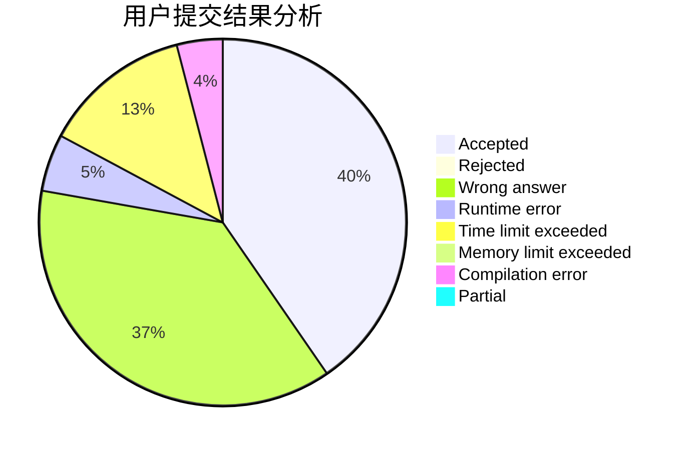
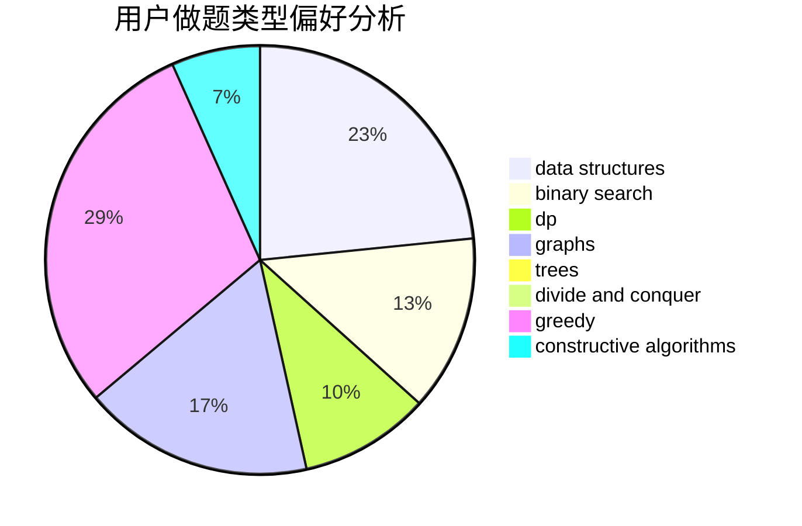
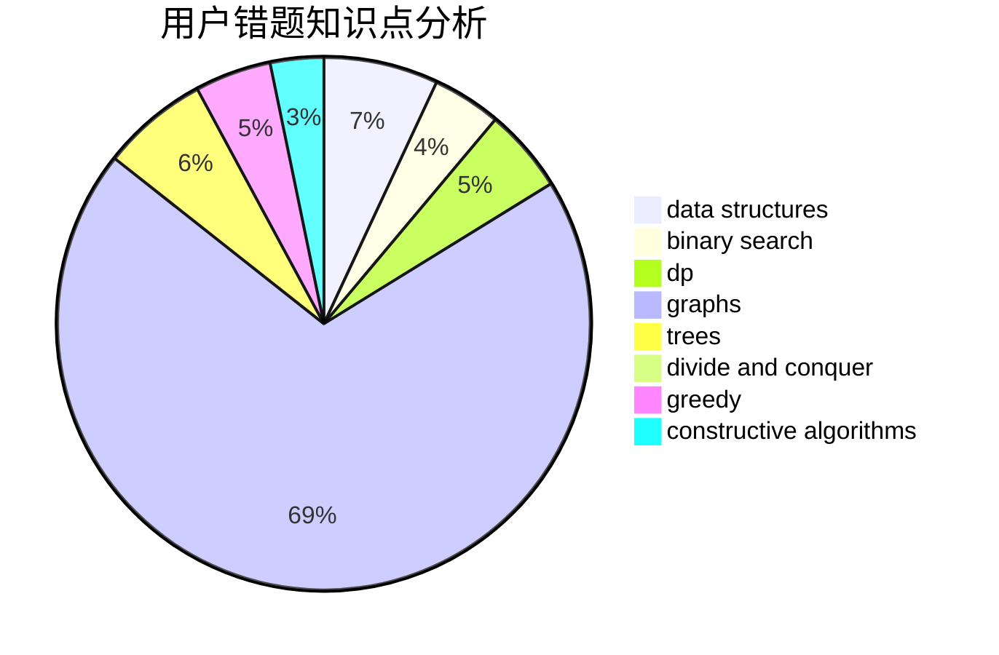

# clpl

<!-- tabs:start -->

#### **用户提交结果分析**

#### **用户做题类型偏好分析**

#### **用户错题知识点分析**

<!-- tabs:end -->
# 推荐题目
[939D](https://codeforces.com/contest/939/problem/D)		dfs and similar,
                        dsu,
                        graphs,
                        greedy,
                        strings		  
[77E](https://codeforces.com/contest/77/problem/E)		geometry		  
[1366B](https://codeforces.com/contest/1366/problem/B)		math,
                        two pointers		  
[550A](https://codeforces.com/contest/550/problem/A)		brute force,
                        dp,
                        greedy,
                        implementation,
                        strings		  
[418C](https://codeforces.com/contest/418/problem/C)		dsu,graphs,sortings,trees		  
[919D](https://codeforces.com/contest/919/problem/D)		dfs and similar,
                        dp,
                        graphs		  
[780H](https://codeforces.com/contest/780/problem/H)		binary search,
                        geometry,
                        implementation,
                        two pointers		  
[6A](https://codeforces.com/contest/6/problem/A)		brute force,
                        geometry		  
[956D](https://codeforces.com/contest/956/problem/D)		dsu,graphs,sortings,trees		  
[1330A](https://codeforces.com/contest/1330/problem/A)		implementation		  
