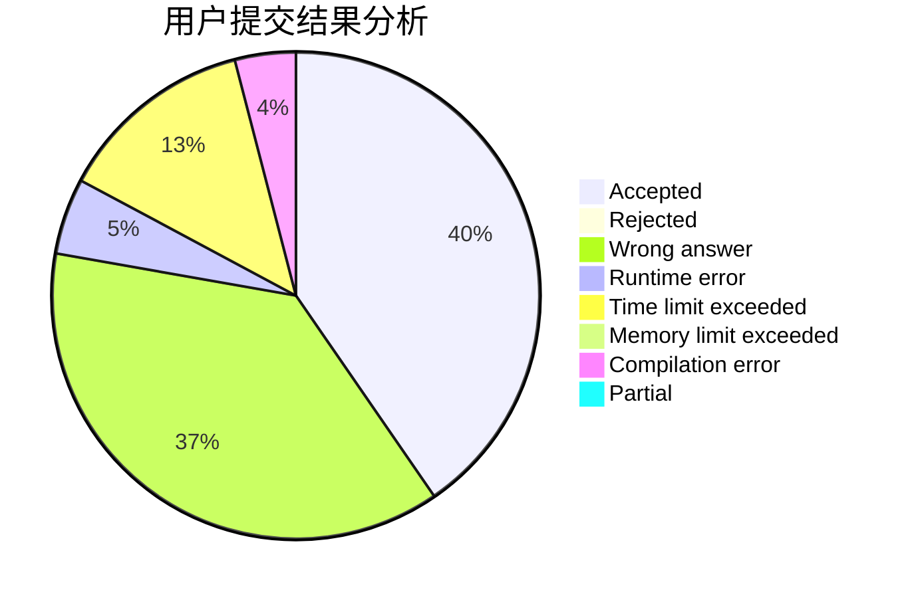
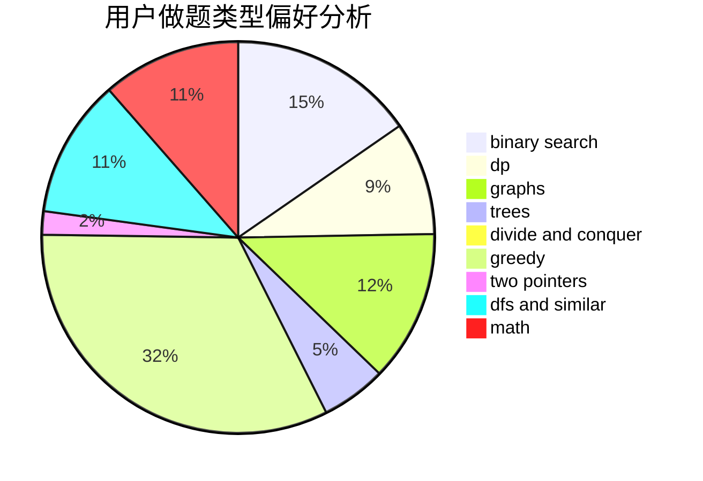

# clpl

<!-- tabs:start -->

#### **用户提交结果分析**

#### **用户做题类型偏好分析**

<!-- tabs:end -->
# 推荐题目
[960G](https://codeforces.com/contest/960/problem/G)
[798C](https://codeforces.com/contest/798/problem/C)
[1373A](https://codeforces.com/contest/1373/problem/A)
[575C](https://codeforces.com/contest/575/problem/C)
[443D](https://codeforces.com/contest/443/problem/D)
[939E](https://codeforces.com/contest/939/problem/E)
[79D](https://codeforces.com/contest/79/problem/D)
[717D](https://codeforces.com/contest/717/problem/D)
[978B](https://codeforces.com/contest/978/problem/B)
[1336A](https://codeforces.com/contest/1336/problem/A)
