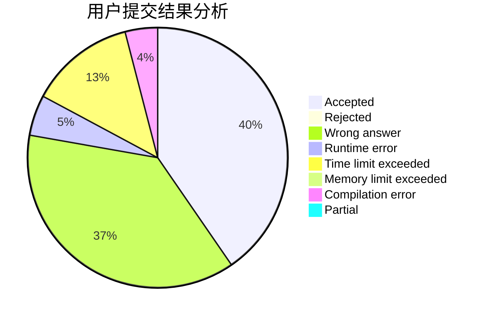
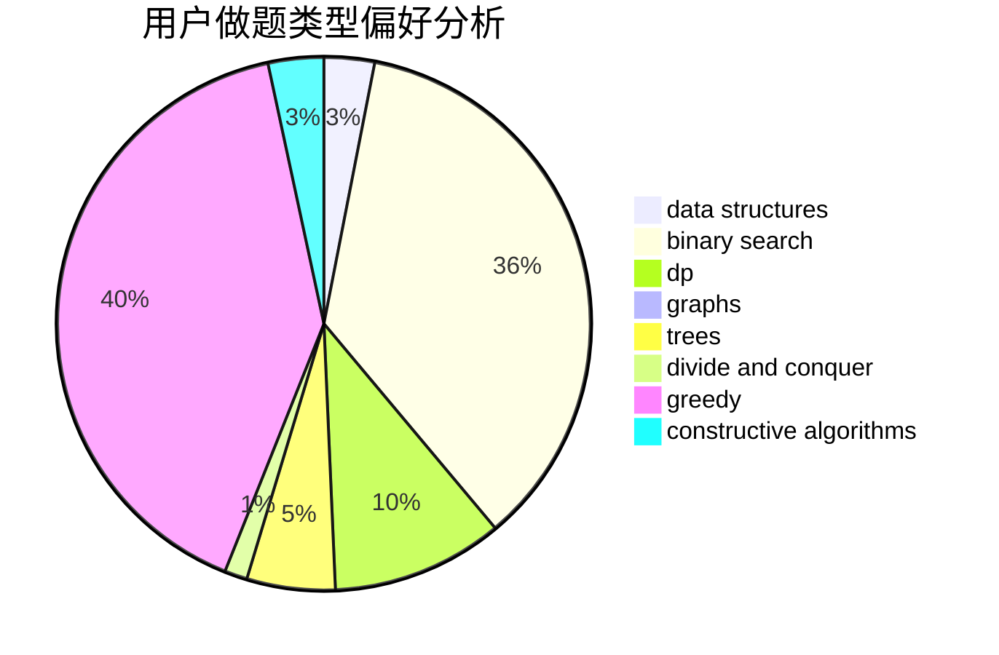
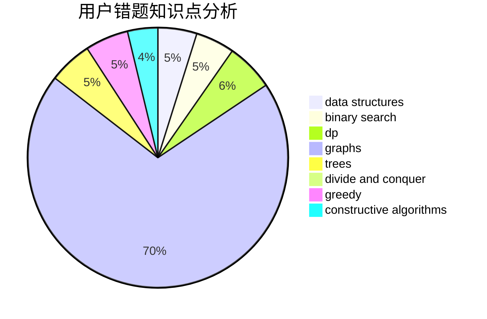

# clpl

<!-- tabs:start -->

#### **用户提交结果分析**

#### **用户做题类型偏好分析**

#### **用户错题知识点分析**

<!-- tabs:end -->
# 推荐题目
[960G](https://codeforces.com/contest/960/problem/G)		combinatorics,
                        dp,
                        fft,
                        math		  
[798C](https://codeforces.com/contest/798/problem/C)		dp,
                        greedy,
                        number theory		  
[1373A](https://codeforces.com/contest/1373/problem/A)		greedy,
                        implementation,
                        math		  
[575C](https://codeforces.com/contest/575/problem/C)		bitmasks,
                        brute force,
                        graph matchings		  
[443D](https://codeforces.com/contest/443/problem/D)		dsu,graphs,sortings,trees		  
[939E](https://codeforces.com/contest/939/problem/E)		binary search,
                        greedy,
                        ternary search,
                        two pointers		  
[79D](https://codeforces.com/contest/79/problem/D)		bitmasks,
                        dp,
                        shortest paths		  
[717D](https://codeforces.com/contest/717/problem/D)		games,
                        matrices,
                        probabilities		  
[978B](https://codeforces.com/contest/978/problem/B)		greedy,
                        strings		  
[1336A](https://codeforces.com/contest/1336/problem/A)		dfs and similar,
                        dp,
                        greedy,
                        sortings,
                        trees		  
