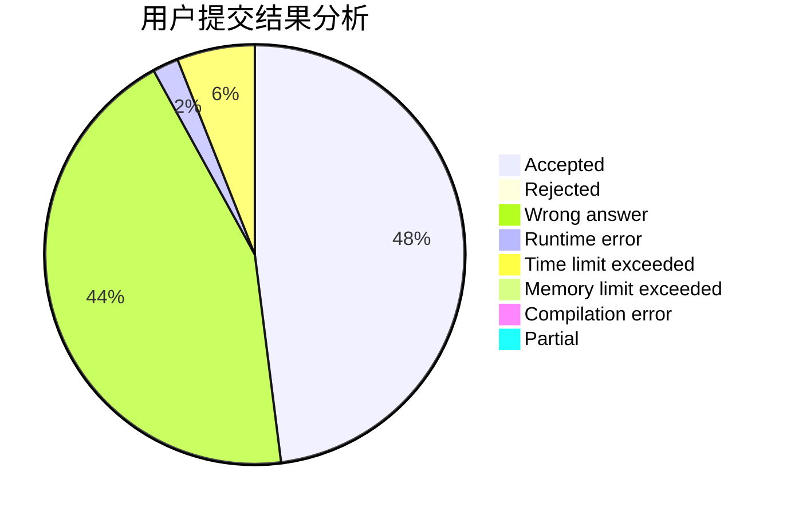
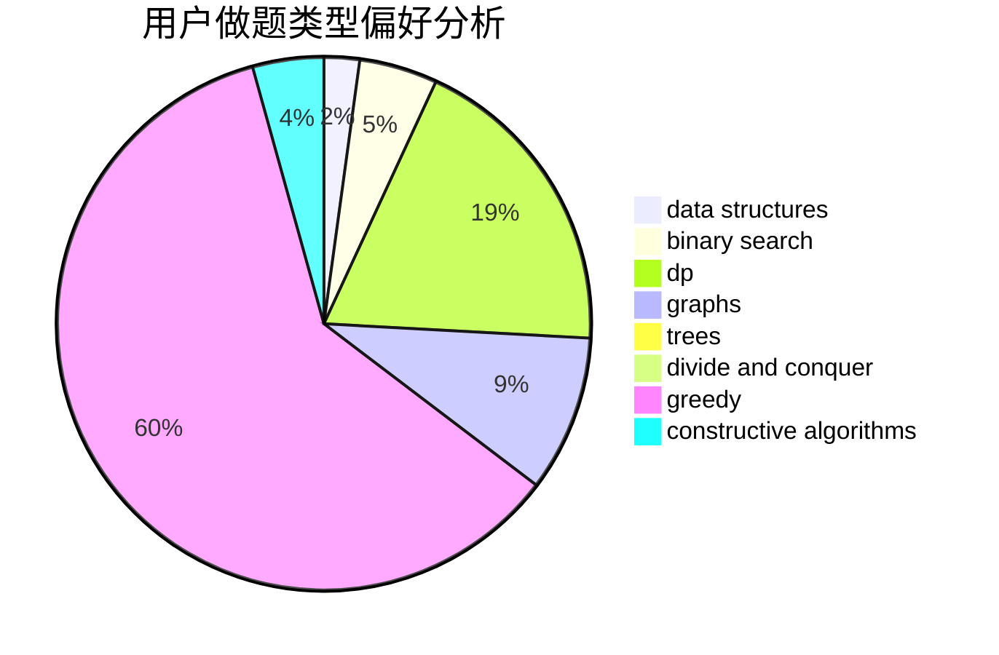
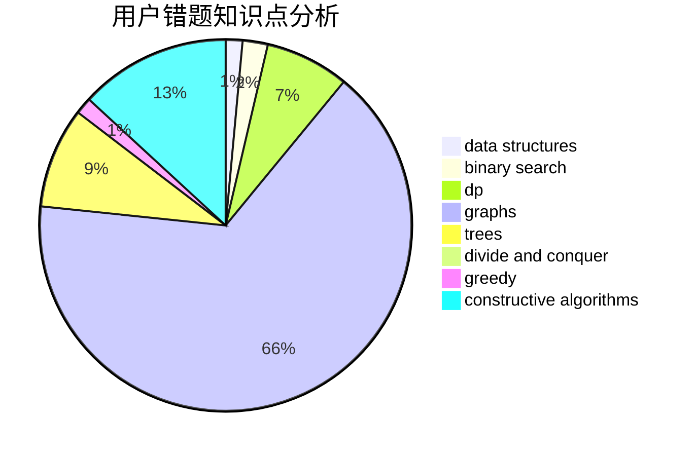

# clzls

<!-- tabs:start -->

#### **用户提交结果分析**

#### **用户做题类型偏好分析**

#### **用户错题知识点分析**

<!-- tabs:end -->
# 推荐题目
[1304D](https://codeforces.com/contest/1304/problem/D)		constructive algorithms,
                        graphs,
                        greedy,
                        two pointers		  
[53E](https://codeforces.com/contest/53/problem/E)		bitmasks,
                        dp		  
[622F](https://codeforces.com/contest/622/problem/F)		math		  
[552E](https://codeforces.com/contest/552/problem/E)		brute force,
                        dp,
                        expression parsing,
                        greedy,
                        implementation,
                        strings		  
[1109A](https://codeforces.com/contest/1109/problem/A)		dp,
                        implementation		  
[1119E](https://codeforces.com/contest/1119/problem/E)		brute force,
                        dp,
                        fft,
                        greedy,
                        ternary search		  
[494C](https://codeforces.com/contest/494/problem/C)		dp,
                        probabilities		  
[1C](https://codeforces.com/contest/1/problem/C)		geometry,
                        math		  
[675B](https://codeforces.com/contest/675/problem/B)		brute force,
                        constructive algorithms,
                        math		  
[475A](https://codeforces.com/contest/475/problem/A)		implementation		  
