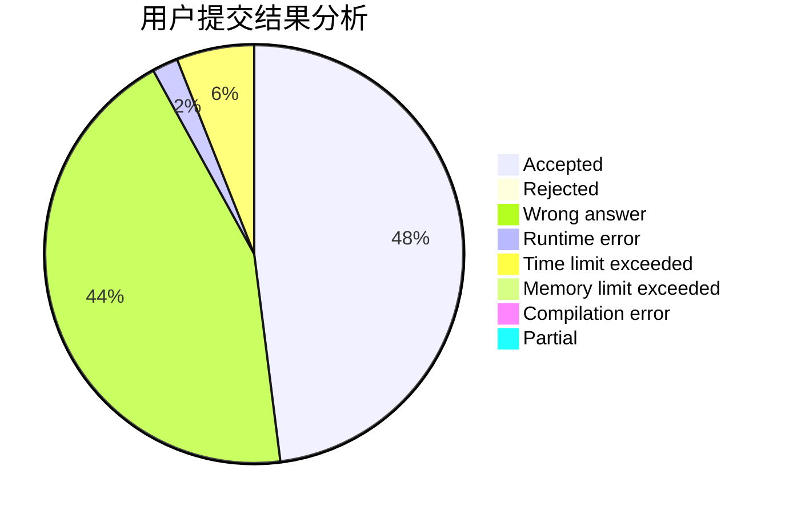
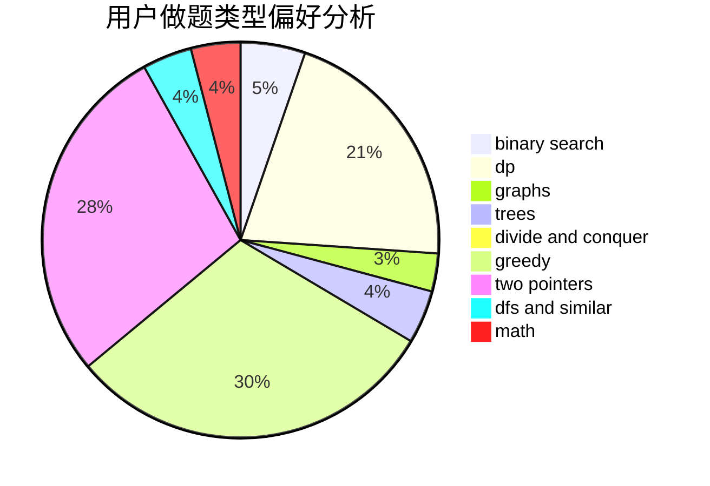

# clzls

<!-- tabs:start -->

#### **用户提交结果分析**

#### **用户做题类型偏好分析**

<!-- tabs:end -->
# 推荐题目
[13132](https://codeforces.com/contest/1313/problem/2)
[560E](https://codeforces.com/contest/560/problem/E)
[650E](https://codeforces.com/contest/650/problem/E)
[578B](https://codeforces.com/contest/578/problem/B)
[1109E](https://codeforces.com/contest/1109/problem/E)
[11292](https://codeforces.com/contest/1129/problem/2)
[514D](https://codeforces.com/contest/514/problem/D)
[224B](https://codeforces.com/contest/224/problem/B)
[69E](https://codeforces.com/contest/69/problem/E)
[494A](https://codeforces.com/contest/494/problem/A)
