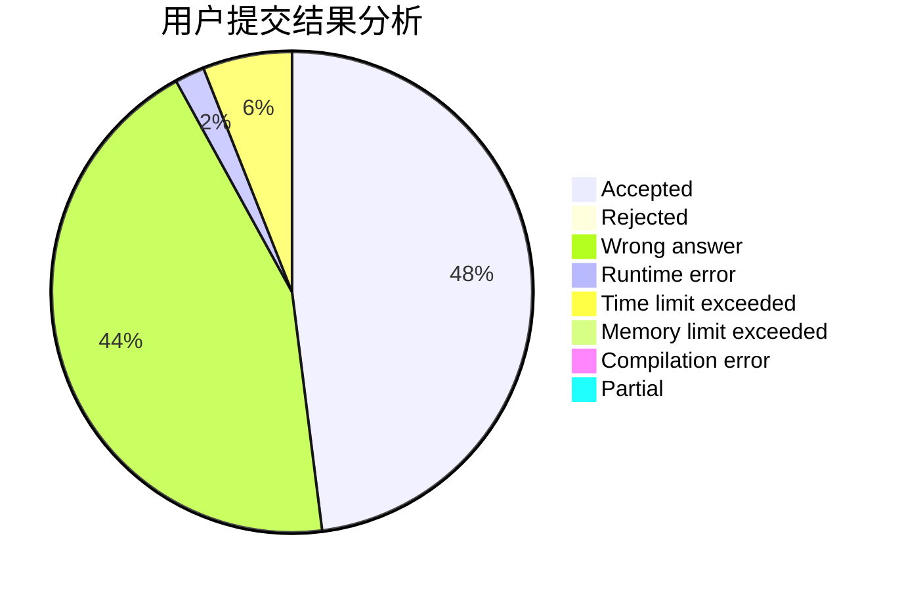
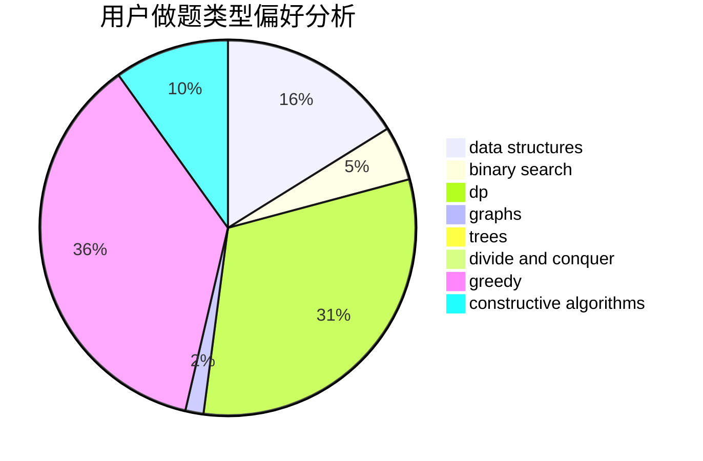
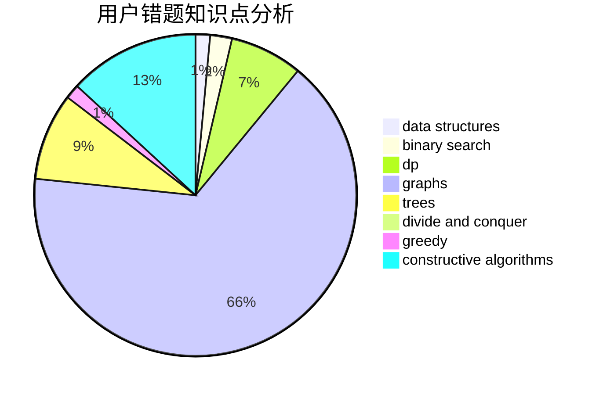

# clzls

<!-- tabs:start -->

#### **用户提交结果分析**

#### **用户做题类型偏好分析**

#### **用户错题知识点分析**

<!-- tabs:end -->
# 推荐题目
[13132](https://codeforces.com/contest/1313/problem/2)		dsu,graphs,sortings,trees		  
[560E](https://codeforces.com/contest/560/problem/E)		dsu,graphs,sortings,trees		  
[650E](https://codeforces.com/contest/650/problem/E)		data structures,
                        dfs and similar,
                        dsu,
                        greedy,
                        trees		  
[578B](https://codeforces.com/contest/578/problem/B)		brute force,
                        greedy		  
[1109E](https://codeforces.com/contest/1109/problem/E)		data structures,
                        number theory		  
[11292](https://codeforces.com/contest/1129/problem/2)		dsu,graphs,sortings,trees		  
[514D](https://codeforces.com/contest/514/problem/D)		binary search,
                        data structures,
                        two pointers		  
[224B](https://codeforces.com/contest/224/problem/B)		bitmasks,
                        implementation,
                        two pointers		  
[69E](https://codeforces.com/contest/69/problem/E)		data structures,
                        implementation		  
[494A](https://codeforces.com/contest/494/problem/A)		greedy		  
