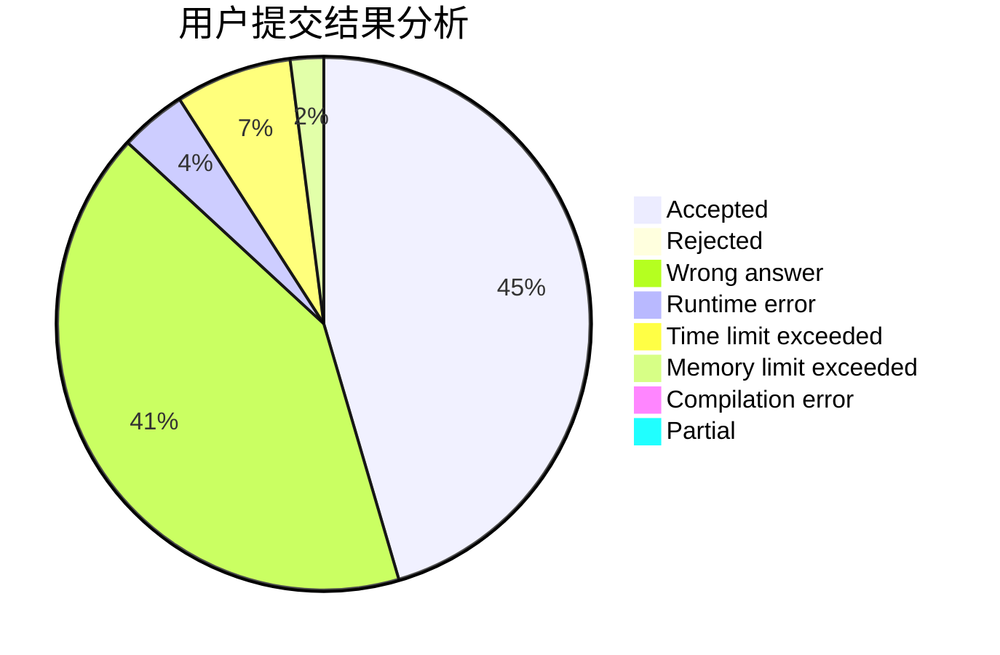
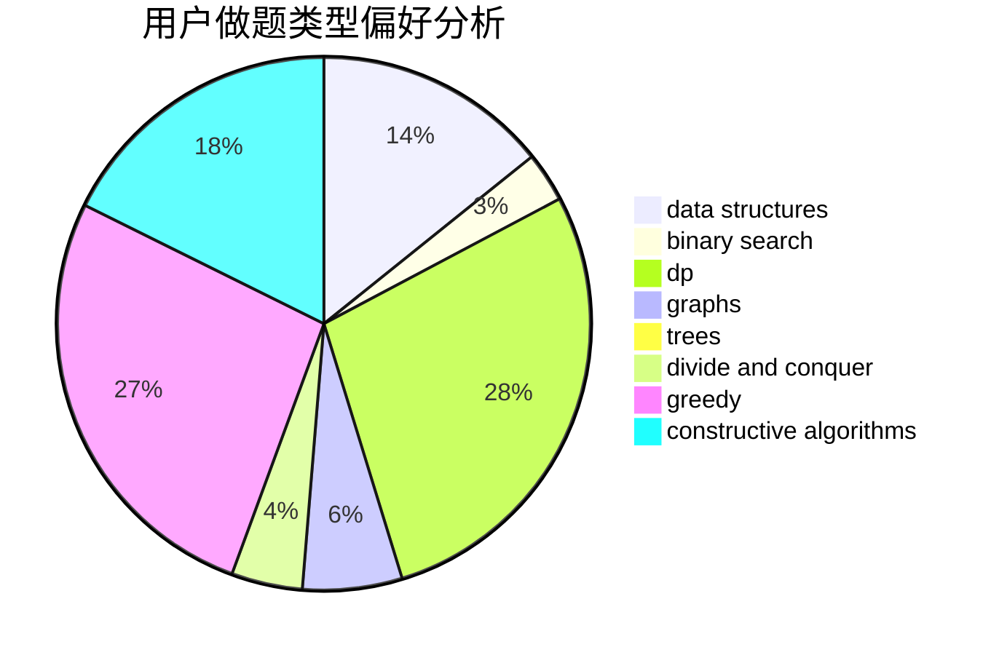
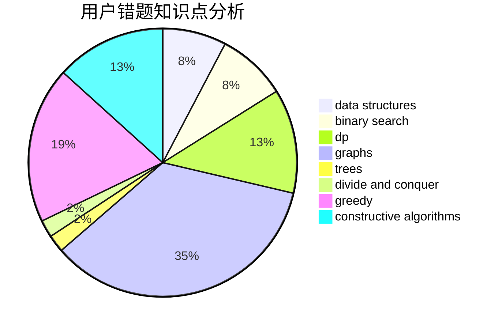

# cmwqf

<!-- tabs:start -->

#### **用户提交结果分析**

#### **用户做题类型偏好分析**

#### **用户错题知识点分析**

<!-- tabs:end -->
# 推荐题目
[1409D](https://codeforces.com/contest/1409/problem/D)		greedy,
                        math		  
[360A](https://codeforces.com/contest/360/problem/A)		greedy,
                        implementation		  
[156D](https://codeforces.com/contest/156/problem/D)		combinatorics,
                        graphs		  
[1000G](https://codeforces.com/contest/1000/problem/G)		data structures,
                        dp,
                        trees		  
[1203B](https://codeforces.com/contest/1203/problem/B)		greedy,
                        math		  
[1303C](https://codeforces.com/contest/1303/problem/C)		dfs and similar,
                        greedy,
                        implementation		  
[587F](https://codeforces.com/contest/587/problem/F)		data structures,
                        strings		  
[703E](https://codeforces.com/contest/703/problem/E)		dp,
                        number theory		  
[508E](https://codeforces.com/contest/508/problem/E)		dp,
                        greedy		  
[618E](https://codeforces.com/contest/618/problem/E)		data structures,
                        geometry		  
