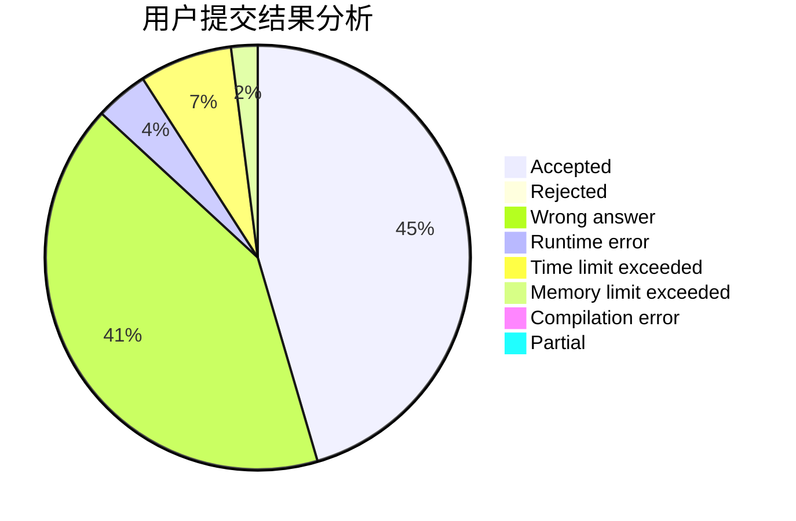
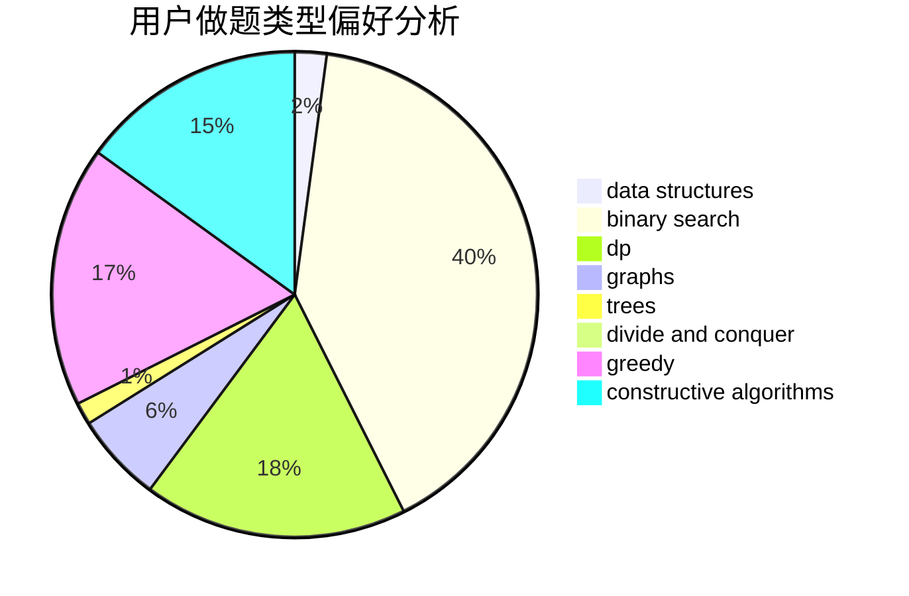
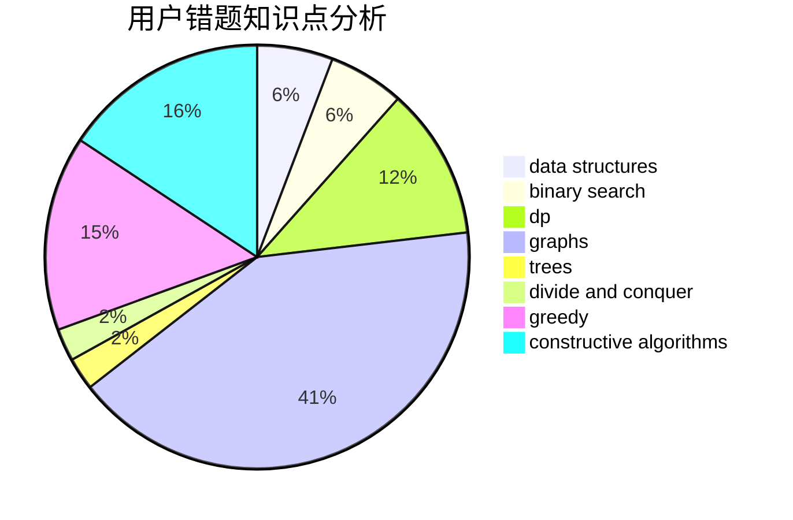

# cmwqf

<!-- tabs:start -->

#### **用户提交结果分析**

#### **用户做题类型偏好分析**

#### **用户错题知识点分析**

<!-- tabs:end -->
# 推荐题目
[14201](https://codeforces.com/contest/1420/problem/1)		dsu,graphs,sortings,trees		  
[388B](https://codeforces.com/contest/388/problem/B)		bitmasks,
                        constructive algorithms,
                        graphs,
                        implementation,
                        math		  
[1772](https://codeforces.com/contest/177/problem/2)		dsu,graphs,sortings,trees		  
[1000G](https://codeforces.com/contest/1000/problem/G)		data structures,
                        dp,
                        trees		  
[1207F](https://codeforces.com/contest/1207/problem/F)		brute force,
                        data structures,
                        implementation		  
[1312A](https://codeforces.com/contest/1312/problem/A)		geometry,
                        greedy,
                        math,
                        number theory		  
[608B](https://codeforces.com/contest/608/problem/B)		combinatorics,
                        strings		  
[723A](https://codeforces.com/contest/723/problem/A)		implementation,
                        math,
                        sortings		  
[529B](https://codeforces.com/contest/529/problem/B)		brute force,
                        greedy,
                        sortings		  
[639D](https://codeforces.com/contest/639/problem/D)		data structures,
                        greedy,
                        sortings,
                        two pointers		  
