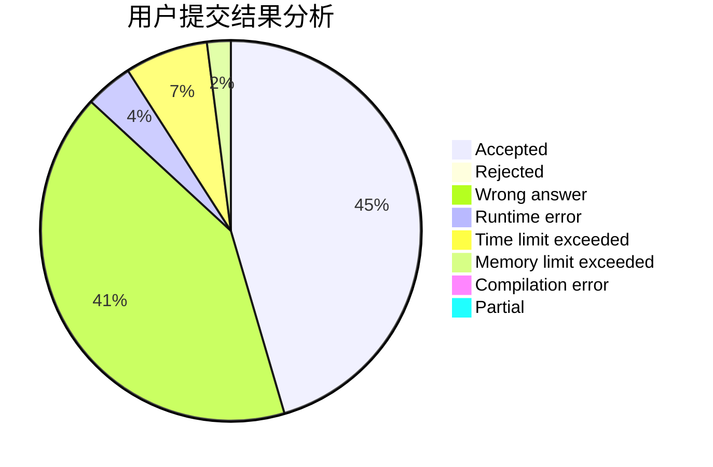
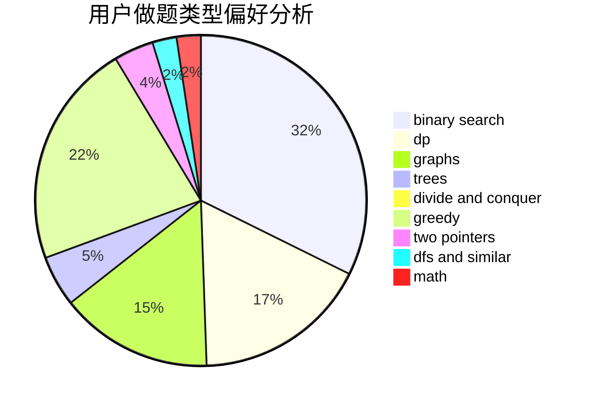

# cmwqf

<!-- tabs:start -->

#### **用户提交结果分析**

#### **用户做题类型偏好分析**

<!-- tabs:end -->
# 推荐题目
[14201](https://codeforces.com/contest/1420/problem/1)
[388B](https://codeforces.com/contest/388/problem/B)
[1772](https://codeforces.com/contest/177/problem/2)
[1000G](https://codeforces.com/contest/1000/problem/G)
[1207F](https://codeforces.com/contest/1207/problem/F)
[1312A](https://codeforces.com/contest/1312/problem/A)
[608B](https://codeforces.com/contest/608/problem/B)
[723A](https://codeforces.com/contest/723/problem/A)
[529B](https://codeforces.com/contest/529/problem/B)
[639D](https://codeforces.com/contest/639/problem/D)
