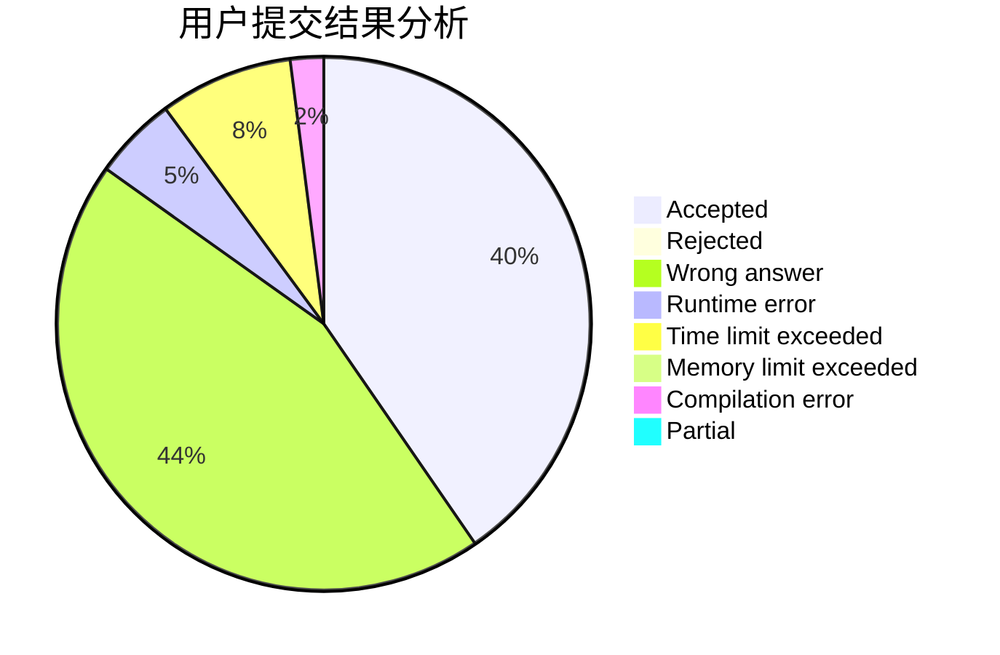
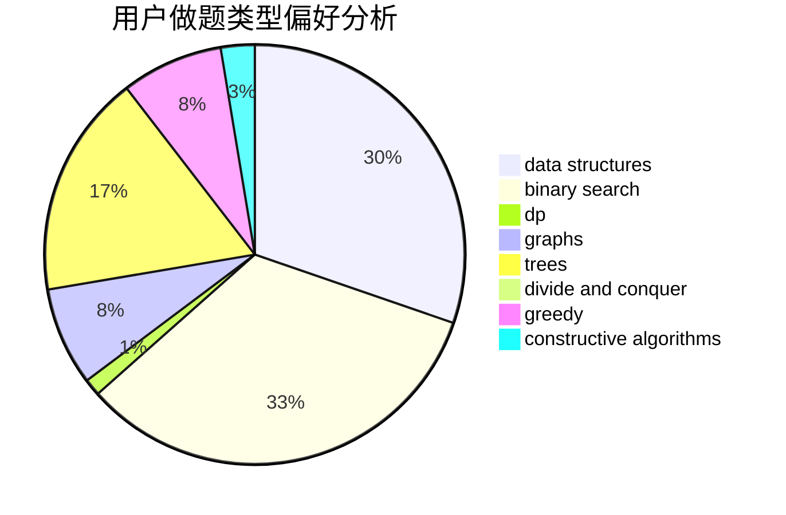

# cocktail

<!-- tabs:start -->

#### **用户提交结果分析**

#### **用户做题类型偏好分析**

#### **用户错题知识点分析**

<!-- tabs:end -->
# 推荐题目
[1423I](https://codeforces.com/contest/1423/problem/I)		bitmasks		  
[571D](https://codeforces.com/contest/571/problem/D)		binary search,
                        data structures,
                        dsu,
                        trees		  
[402C](https://codeforces.com/contest/402/problem/C)		brute force,
                        constructive algorithms,
                        graphs		  
[364A](https://codeforces.com/contest/364/problem/A)		combinatorics,
                        data structures,
                        implementation		  
[1288C](https://codeforces.com/contest/1288/problem/C)		combinatorics,
                        dp		  
[1110A](https://codeforces.com/contest/1110/problem/A)		math		  
[1504D](https://codeforces.com/contest/1504/problem/D)		dsu,graphs,sortings,trees		  
[1320A](https://codeforces.com/contest/1320/problem/A)		data structures,
                        dp,
                        greedy,
                        math,
                        sortings		  
[575H](https://codeforces.com/contest/575/problem/H)		combinatorics,
                        number theory		  
[20C](https://codeforces.com/contest/20/problem/C)		graphs,
                        shortest paths		  
