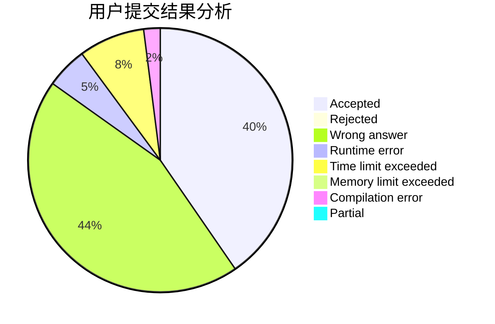
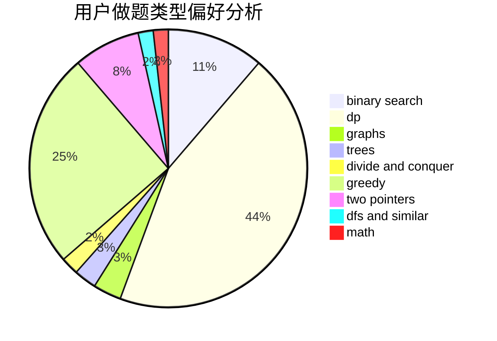

# cocktail

<!-- tabs:start -->

#### **用户提交结果分析**

#### **用户做题类型偏好分析**

<!-- tabs:end -->
# 推荐题目
[1431D](https://codeforces.com/contest/1431/problem/D)
[592A](https://codeforces.com/contest/592/problem/A)
[430C](https://codeforces.com/contest/430/problem/C)
[38E](https://codeforces.com/contest/38/problem/E)
[1295E](https://codeforces.com/contest/1295/problem/E)
[1110D](https://codeforces.com/contest/1110/problem/D)
[1513C](https://codeforces.com/contest/1513/problem/C)
[1327A](https://codeforces.com/contest/1327/problem/A)
[597C](https://codeforces.com/contest/597/problem/C)
[231E](https://codeforces.com/contest/231/problem/E)
