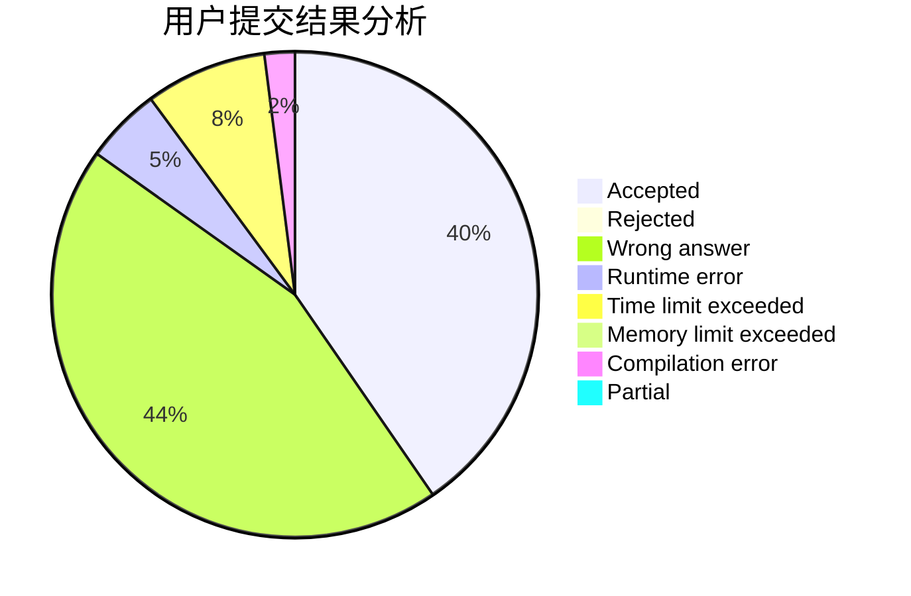
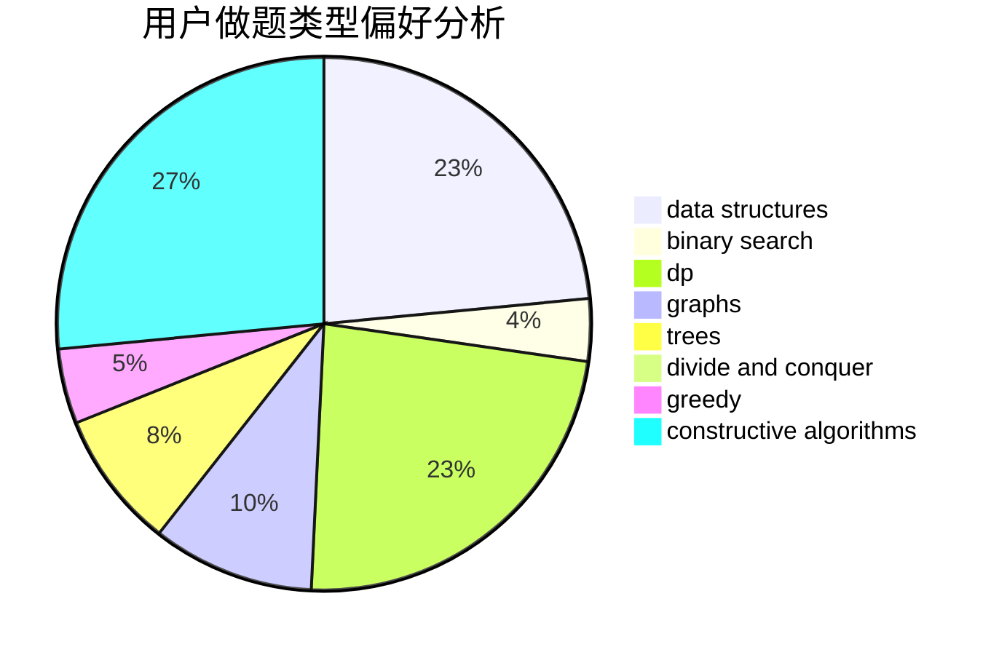

# cocktail

<!-- tabs:start -->

#### **用户提交结果分析**

#### **用户做题类型偏好分析**

#### **用户错题知识点分析**

<!-- tabs:end -->
# 推荐题目
[1431D](https://codeforces.com/contest/1431/problem/D)		*special problem,
                        greedy		  
[592A](https://codeforces.com/contest/592/problem/A)		implementation		  
[430C](https://codeforces.com/contest/430/problem/C)		dsu,graphs,sortings,trees		  
[38E](https://codeforces.com/contest/38/problem/E)		dp,
                        sortings		  
[1295E](https://codeforces.com/contest/1295/problem/E)		data structures,
                        divide and conquer		  
[1110D](https://codeforces.com/contest/1110/problem/D)		dp		  
[1513C](https://codeforces.com/contest/1513/problem/C)		dp,
                        matrices		  
[1327A](https://codeforces.com/contest/1327/problem/A)		math		  
[597C](https://codeforces.com/contest/597/problem/C)		data structures,
                        dp		  
[231E](https://codeforces.com/contest/231/problem/E)		data structures,
                        dfs and similar,
                        dp,
                        graphs,
                        trees		  
