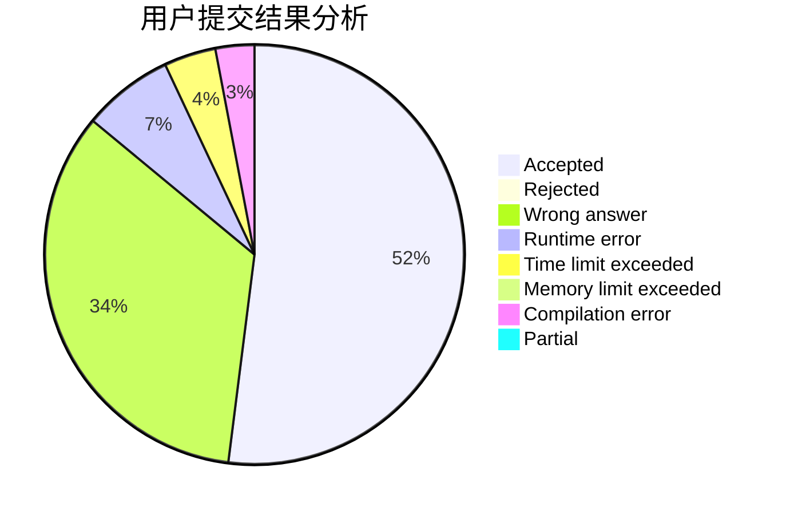
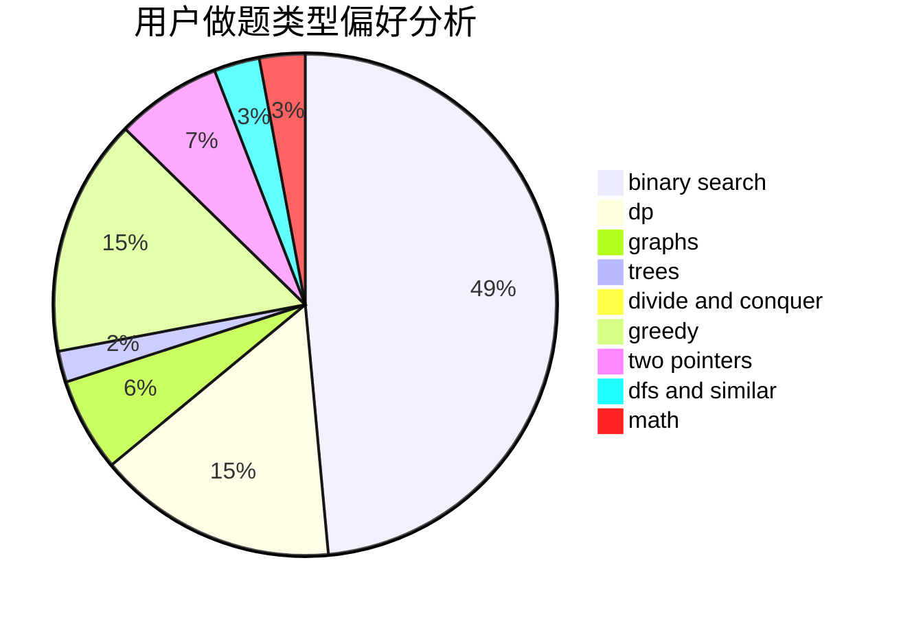

# codecrime

<!-- tabs:start -->

#### **用户提交结果分析**

#### **用户做题类型偏好分析**

<!-- tabs:end -->
# 推荐题目
[868D](https://codeforces.com/contest/868/problem/D)
[584B](https://codeforces.com/contest/584/problem/B)
[659A](https://codeforces.com/contest/659/problem/A)
[1210D](https://codeforces.com/contest/1210/problem/D)
[386C](https://codeforces.com/contest/386/problem/C)
[879A](https://codeforces.com/contest/879/problem/A)
[1402B](https://codeforces.com/contest/1402/problem/B)
[848A](https://codeforces.com/contest/848/problem/A)
[602A](https://codeforces.com/contest/602/problem/A)
[1211B](https://codeforces.com/contest/1211/problem/B)
