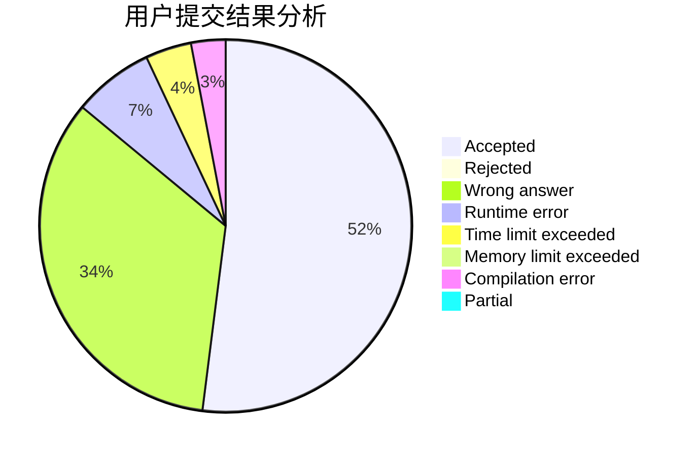
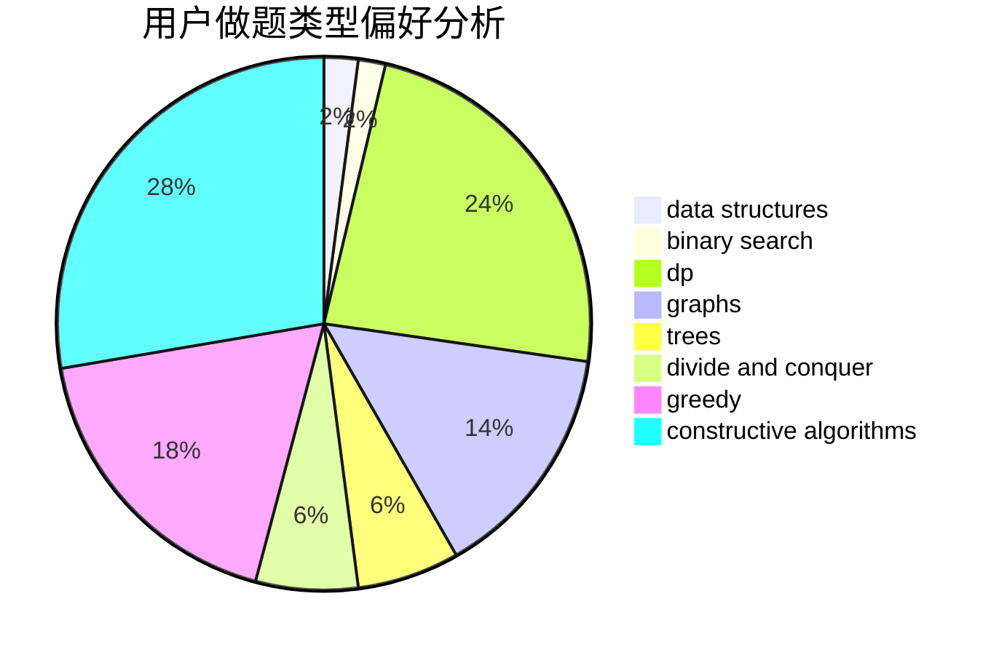
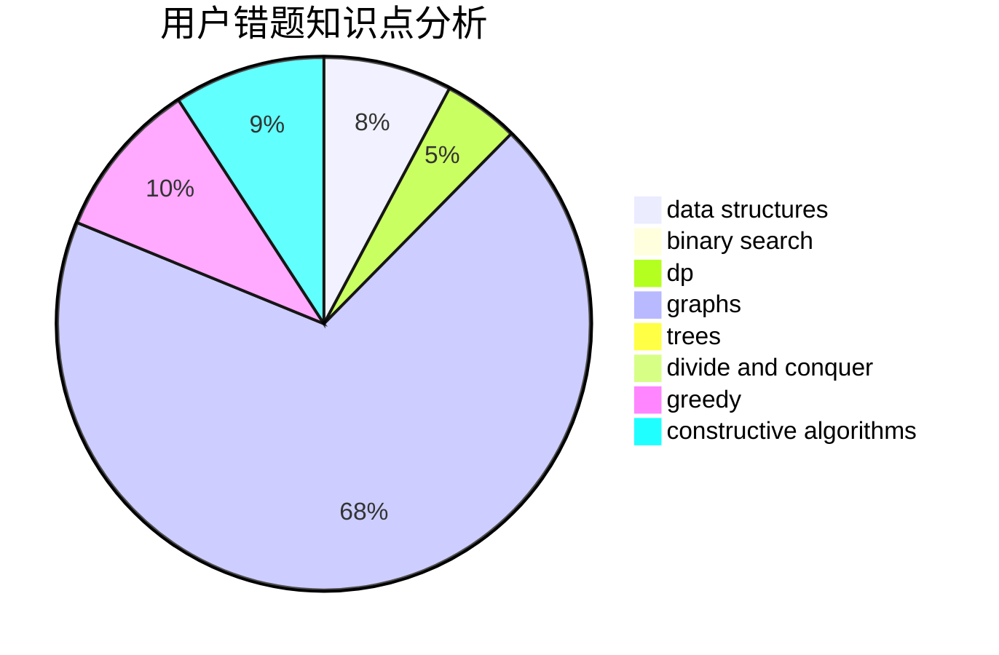

# codecrime

<!-- tabs:start -->

#### **用户提交结果分析**

#### **用户做题类型偏好分析**

#### **用户错题知识点分析**

<!-- tabs:end -->
# 推荐题目
[849B](https://codeforces.com/contest/849/problem/B)		brute force,
                        geometry		  
[55D](https://codeforces.com/contest/55/problem/D)		dp,
                        number theory		  
[629A](https://codeforces.com/contest/629/problem/A)		brute force,
                        combinatorics,
                        constructive algorithms,
                        implementation		  
[1206C](https://codeforces.com/contest/1206/problem/C)		dsu,graphs,sortings,trees		  
[359C](https://codeforces.com/contest/359/problem/C)		math,
                        number theory		  
[861A](https://codeforces.com/contest/861/problem/A)		dsu,graphs,sortings,trees		  
[1394C](https://codeforces.com/contest/1394/problem/C)		binary search,
                        geometry,
                        ternary search		  
[830A](https://codeforces.com/contest/830/problem/A)		binary search,
                        brute force,
                        dp,
                        greedy,
                        sortings		  
[581D](https://codeforces.com/contest/581/problem/D)		bitmasks,
                        brute force,
                        constructive algorithms,
                        geometry,
                        implementation,
                        math		  
[1207B](https://codeforces.com/contest/1207/problem/B)		constructive algorithms,
                        greedy,
                        implementation		  
