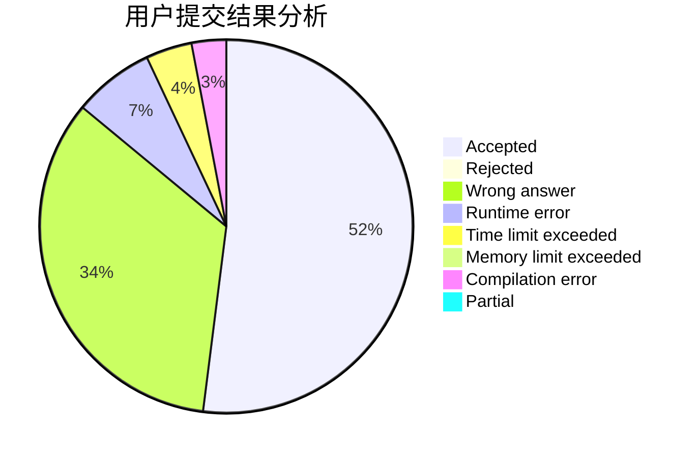
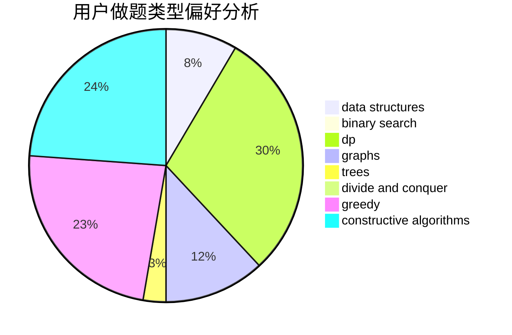
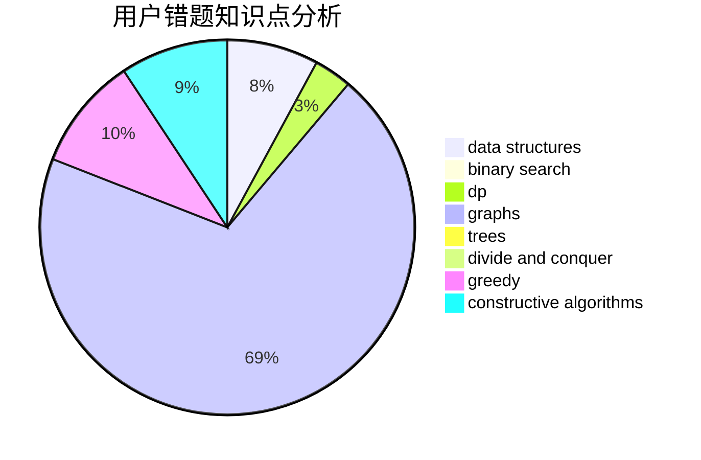

# codecrime

<!-- tabs:start -->

#### **用户提交结果分析**

#### **用户做题类型偏好分析**

#### **用户错题知识点分析**

<!-- tabs:end -->
# 推荐题目
[868D](https://codeforces.com/contest/868/problem/D)		bitmasks,
                        brute force,
                        dp,
                        implementation,
                        strings		  
[584B](https://codeforces.com/contest/584/problem/B)		combinatorics		  
[659A](https://codeforces.com/contest/659/problem/A)		implementation,
                        math		  
[1210D](https://codeforces.com/contest/1210/problem/D)		graphs		  
[386C](https://codeforces.com/contest/386/problem/C)		dp,
                        strings,
                        two pointers		  
[879A](https://codeforces.com/contest/879/problem/A)		implementation		  
[1402B](https://codeforces.com/contest/1402/problem/B)		*special problem,
                        geometry,
                        sortings		  
[848A](https://codeforces.com/contest/848/problem/A)		constructive algorithms		  
[602A](https://codeforces.com/contest/602/problem/A)		brute force,
                        implementation		  
[1211B](https://codeforces.com/contest/1211/problem/B)		*special problem,
                        implementation		  
