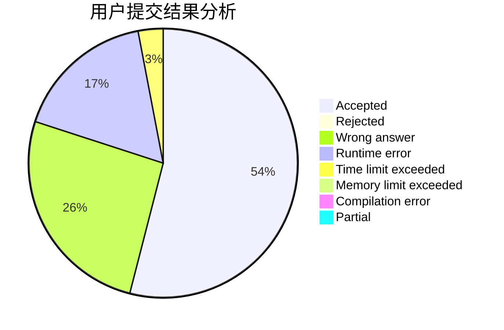
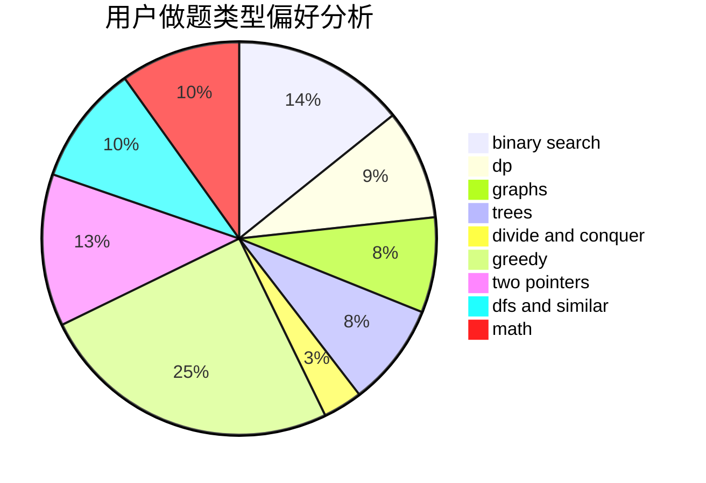

# codesonic

<!-- tabs:start -->

#### **用户提交结果分析**

#### **用户做题类型偏好分析**

<!-- tabs:end -->
# 推荐题目
[1355C](https://codeforces.com/contest/1355/problem/C)
[1338A](https://codeforces.com/contest/1338/problem/A)
[1065A](https://codeforces.com/contest/1065/problem/A)
[605D](https://codeforces.com/contest/605/problem/D)
[1297C](https://codeforces.com/contest/1297/problem/C)
[917B](https://codeforces.com/contest/917/problem/B)
[75A](https://codeforces.com/contest/75/problem/A)
[987F](https://codeforces.com/contest/987/problem/F)
[772E](https://codeforces.com/contest/772/problem/E)
[34A](https://codeforces.com/contest/34/problem/A)
