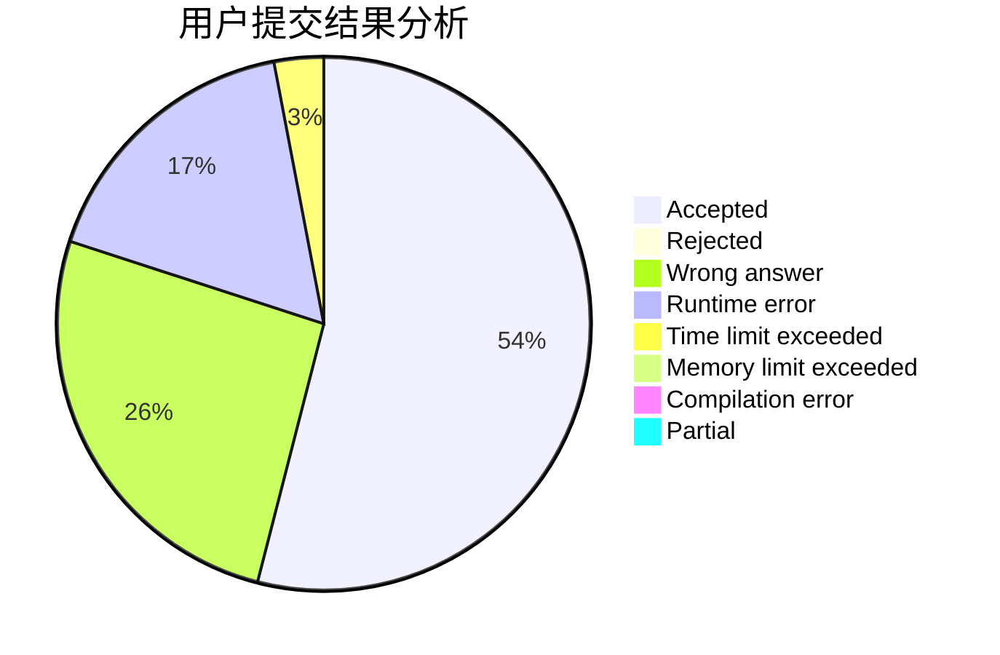
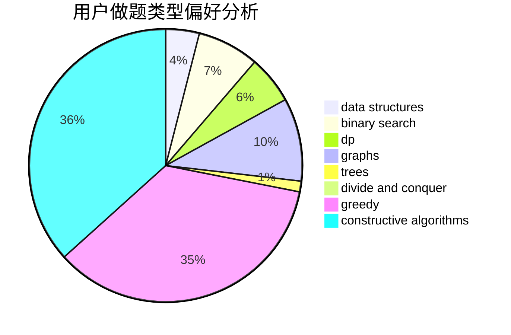

# codesonic

<!-- tabs:start -->

#### **用户提交结果分析**

#### **用户做题类型偏好分析**

#### **用户错题知识点分析**

<!-- tabs:end -->
# 推荐题目
[1348E](https://codeforces.com/contest/1348/problem/E)		brute force,
                        dp,
                        greedy,
                        math		  
[1331G](https://codeforces.com/contest/1331/problem/G)		nan		  
[1064D](https://codeforces.com/contest/1064/problem/D)		dsu,graphs,sortings,trees		  
[585C](https://codeforces.com/contest/585/problem/C)		number theory		  
[1290F](https://codeforces.com/contest/1290/problem/F)		dp		  
[900D](https://codeforces.com/contest/900/problem/D)		bitmasks,
                        combinatorics,
                        dp,
                        math,
                        number theory		  
[739B](https://codeforces.com/contest/739/problem/B)		binary search,
                        data structures,
                        dfs and similar,
                        graphs,
                        trees		  
[966A](https://codeforces.com/contest/966/problem/A)		dsu,graphs,sortings,trees		  
[754D](https://codeforces.com/contest/754/problem/D)		binary search,
                        data structures,
                        greedy,
                        sortings		  
[319B](https://codeforces.com/contest/319/problem/B)		data structures,
                        implementation		  
