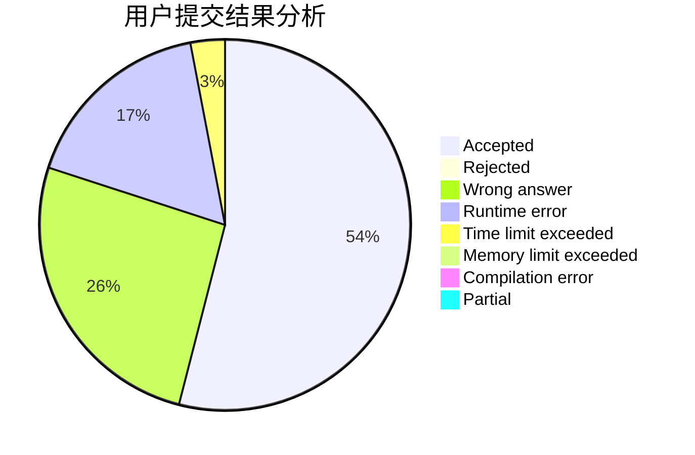
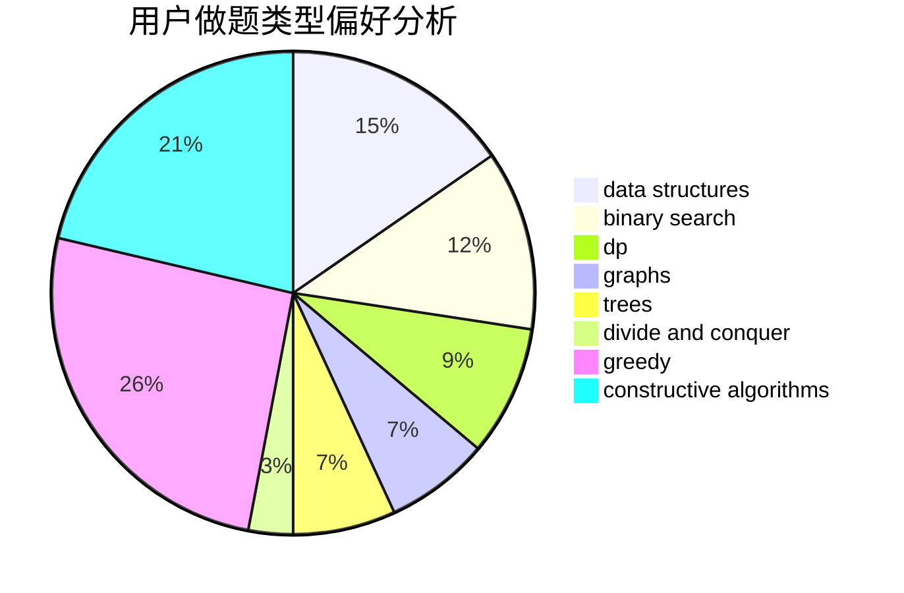

# codesonic

<!-- tabs:start -->

#### **用户提交结果分析**

#### **用户做题类型偏好分析**

#### **用户错题知识点分析**

<!-- tabs:end -->
# 推荐题目
[1355C](https://codeforces.com/contest/1355/problem/C)		binary search,
                        implementation,
                        math,
                        two pointers		  
[1338A](https://codeforces.com/contest/1338/problem/A)		greedy,
                        math		  
[1065A](https://codeforces.com/contest/1065/problem/A)		implementation,
                        math		  
[605D](https://codeforces.com/contest/605/problem/D)		data structures,
                        dfs and similar		  
[1297C](https://codeforces.com/contest/1297/problem/C)		*special problem,
                        greedy		  
[917B](https://codeforces.com/contest/917/problem/B)		dfs and similar,
                        dp,
                        games,
                        graphs		  
[75A](https://codeforces.com/contest/75/problem/A)		implementation		  
[987F](https://codeforces.com/contest/987/problem/F)		dsu,graphs,sortings,trees		  
[772E](https://codeforces.com/contest/772/problem/E)		binary search,
                        divide and conquer,
                        interactive,
                        trees		  
[34A](https://codeforces.com/contest/34/problem/A)		implementation		  
