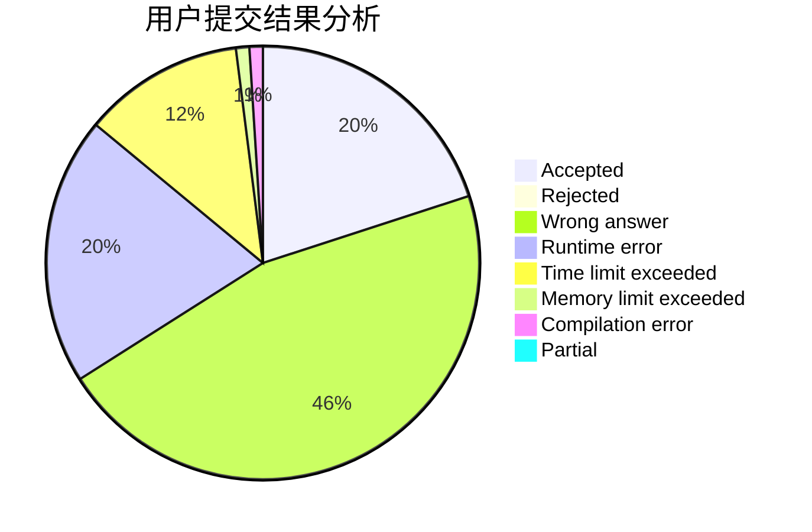
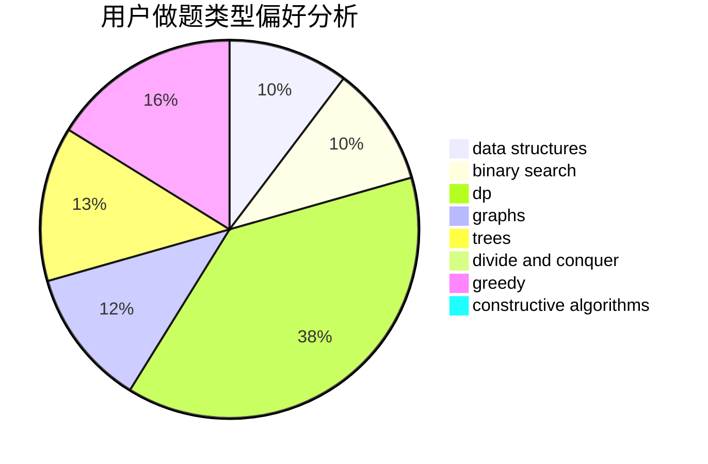
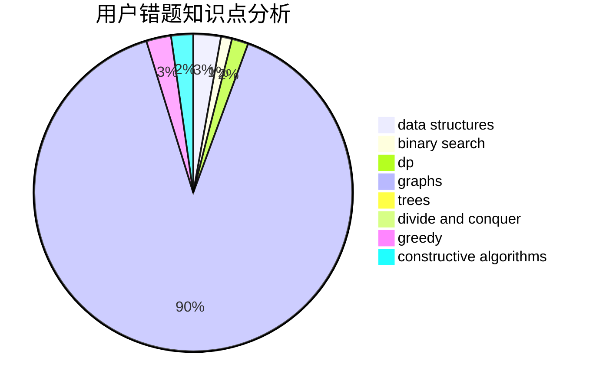

# codycode

<!-- tabs:start -->

#### **用户提交结果分析**

#### **用户做题类型偏好分析**

#### **用户错题知识点分析**

<!-- tabs:end -->
# 推荐题目
[497D](https://codeforces.com/contest/497/problem/D)		brute force,
                        geometry,
                        math		  
[782C](https://codeforces.com/contest/782/problem/C)		dsu,graphs,sortings,trees		  
[514D](https://codeforces.com/contest/514/problem/D)		binary search,
                        data structures,
                        two pointers		  
[323C](https://codeforces.com/contest/323/problem/C)		data structures		  
[1099F](https://codeforces.com/contest/1099/problem/F)		binary search,
                        data structures,
                        dfs and similar,
                        dp,
                        games,
                        trees		  
[1089A](https://codeforces.com/contest/1089/problem/A)		dp		  
[964C](https://codeforces.com/contest/964/problem/C)		dsu,graphs,sortings,trees		  
[821B](https://codeforces.com/contest/821/problem/B)		brute force,
                        math		  
[632E](https://codeforces.com/contest/632/problem/E)		divide and conquer,
                        dp,
                        fft,
                        math		  
[1409A](https://codeforces.com/contest/1409/problem/A)		greedy,
                        math		  
