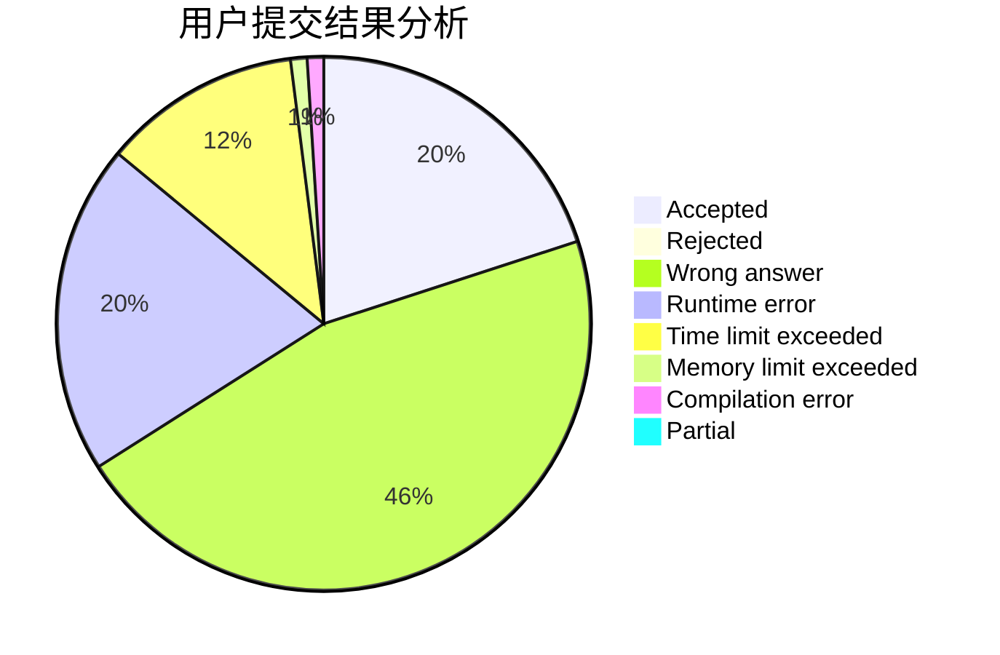
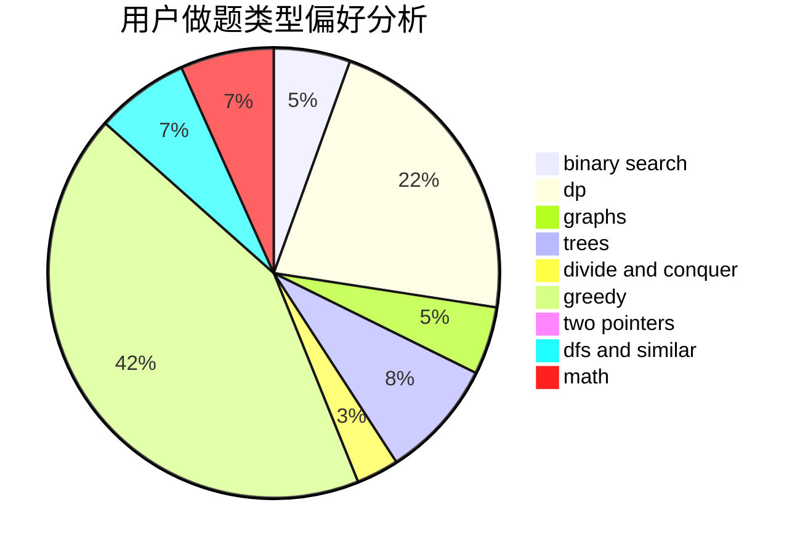

# codycode

<!-- tabs:start -->

#### **用户提交结果分析**

#### **用户做题类型偏好分析**

<!-- tabs:end -->
# 推荐题目
[497D](https://codeforces.com/contest/497/problem/D)
[782C](https://codeforces.com/contest/782/problem/C)
[514D](https://codeforces.com/contest/514/problem/D)
[323C](https://codeforces.com/contest/323/problem/C)
[1099F](https://codeforces.com/contest/1099/problem/F)
[1089A](https://codeforces.com/contest/1089/problem/A)
[964C](https://codeforces.com/contest/964/problem/C)
[821B](https://codeforces.com/contest/821/problem/B)
[632E](https://codeforces.com/contest/632/problem/E)
[1409A](https://codeforces.com/contest/1409/problem/A)
