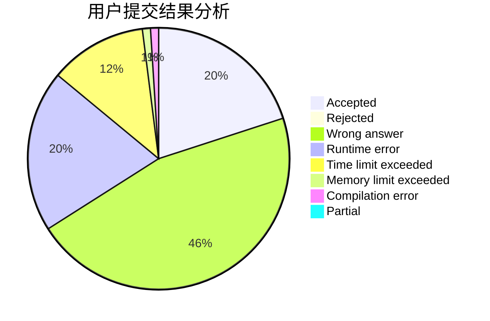
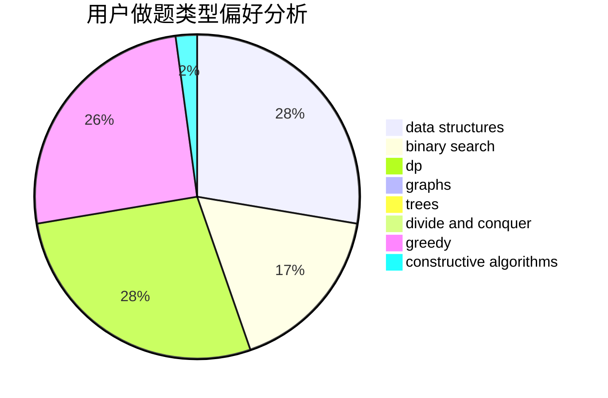
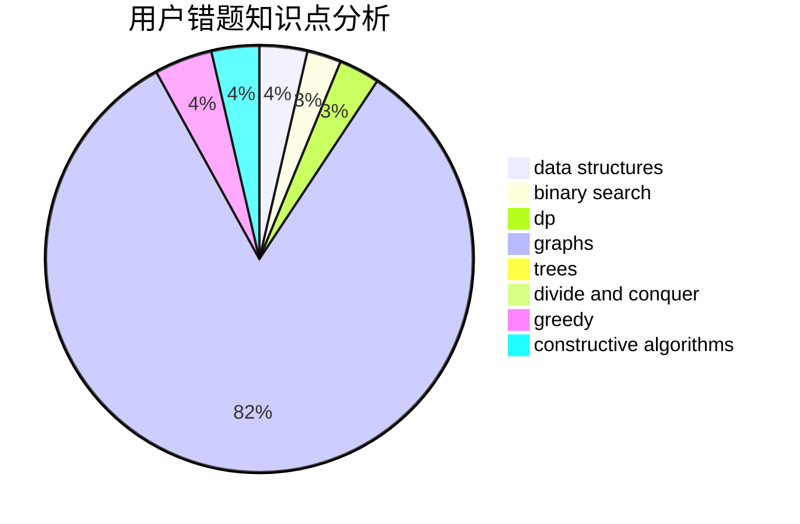

# codycode

<!-- tabs:start -->

#### **用户提交结果分析**

#### **用户做题类型偏好分析**

#### **用户错题知识点分析**

<!-- tabs:end -->
# 推荐题目
[477D](https://codeforces.com/contest/477/problem/D)		dp,
                        strings		  
[763E](https://codeforces.com/contest/763/problem/E)		data structures,
                        divide and conquer,
                        dsu		  
[494C](https://codeforces.com/contest/494/problem/C)		dp,
                        probabilities		  
[304B](https://codeforces.com/contest/304/problem/B)		brute force,
                        implementation		  
[1099C](https://codeforces.com/contest/1099/problem/C)		constructive algorithms,
                        implementation		  
[1088D](https://codeforces.com/contest/1088/problem/D)		bitmasks,
                        constructive algorithms,
                        implementation,
                        interactive		  
[947D](https://codeforces.com/contest/947/problem/D)		dsu,graphs,sortings,trees		  
[805A](https://codeforces.com/contest/805/problem/A)		greedy,
                        math		  
[613C](https://codeforces.com/contest/613/problem/C)		constructive algorithms,
                        math		  
[13A](https://codeforces.com/contest/13/problem/A)		implementation,
                        math		  
