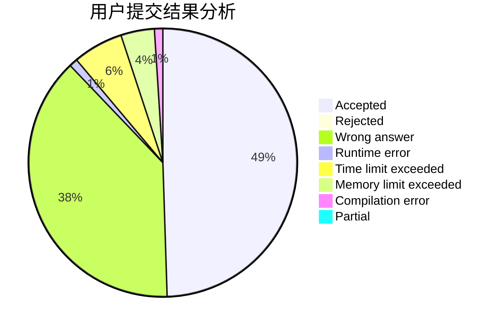
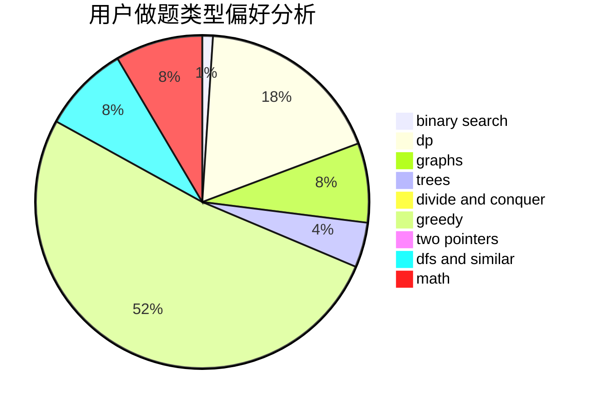

# Apsara

<!-- tabs:start -->

#### **用户提交结果分析**

#### **用户做题类型偏好分析**

<!-- tabs:end -->
# 推荐题目
[1375C](https://codeforces.com/contest/1375/problem/C)
[3D](https://codeforces.com/contest/3/problem/D)
[401D](https://codeforces.com/contest/401/problem/D)
[1420D](https://codeforces.com/contest/1420/problem/D)
[403E](https://codeforces.com/contest/403/problem/E)
[1140D](https://codeforces.com/contest/1140/problem/D)
[400E](https://codeforces.com/contest/400/problem/E)
[34C](https://codeforces.com/contest/34/problem/C)
[402E](https://codeforces.com/contest/402/problem/E)
[1270I](https://codeforces.com/contest/1270/problem/I)
