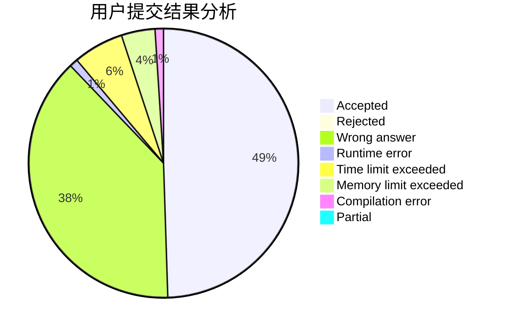
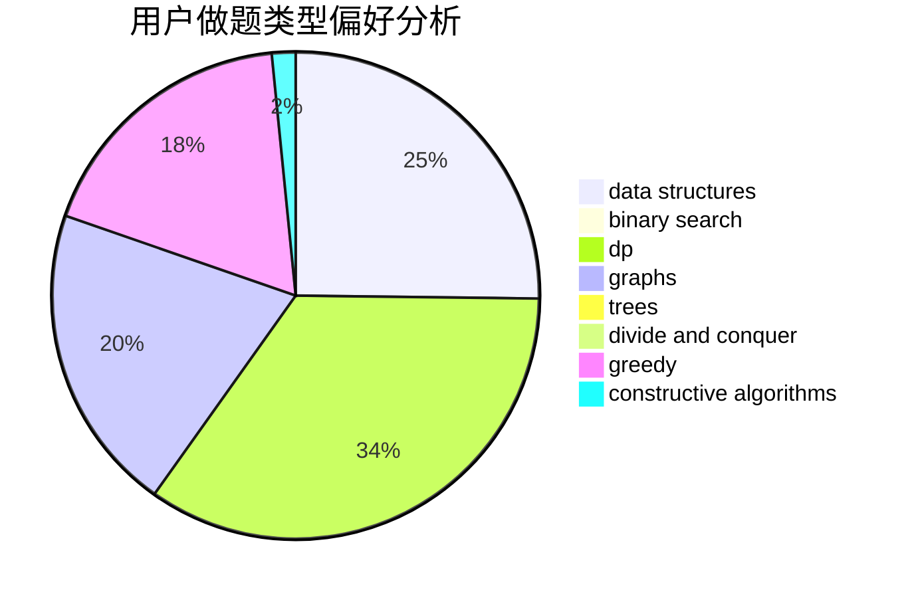

# Apsara

<!-- tabs:start -->

#### **用户提交结果分析**

#### **用户做题类型偏好分析**

#### **用户错题知识点分析**

<!-- tabs:end -->
# 推荐题目
[1368D](https://codeforces.com/contest/1368/problem/D)		bitmasks,
                        greedy,
                        math		  
[370B](https://codeforces.com/contest/370/problem/B)		implementation		  
[371E](https://codeforces.com/contest/371/problem/E)		greedy,
                        math,
                        two pointers		  
[140B](https://codeforces.com/contest/140/problem/B)		brute force,
                        greedy,
                        implementation		  
[375D](https://codeforces.com/contest/375/problem/D)		data structures,
                        dfs and similar,
                        trees		  
[1138F](https://codeforces.com/contest/1138/problem/F)		dsu,graphs,sortings,trees		  
[371C](https://codeforces.com/contest/371/problem/C)		binary search,
                        brute force		  
[319C](https://codeforces.com/contest/319/problem/C)		dp,
                        geometry		  
[374A](https://codeforces.com/contest/374/problem/A)		greedy,
                        implementation		  
[1265D](https://codeforces.com/contest/1265/problem/D)		dsu,graphs,sortings,trees		  
