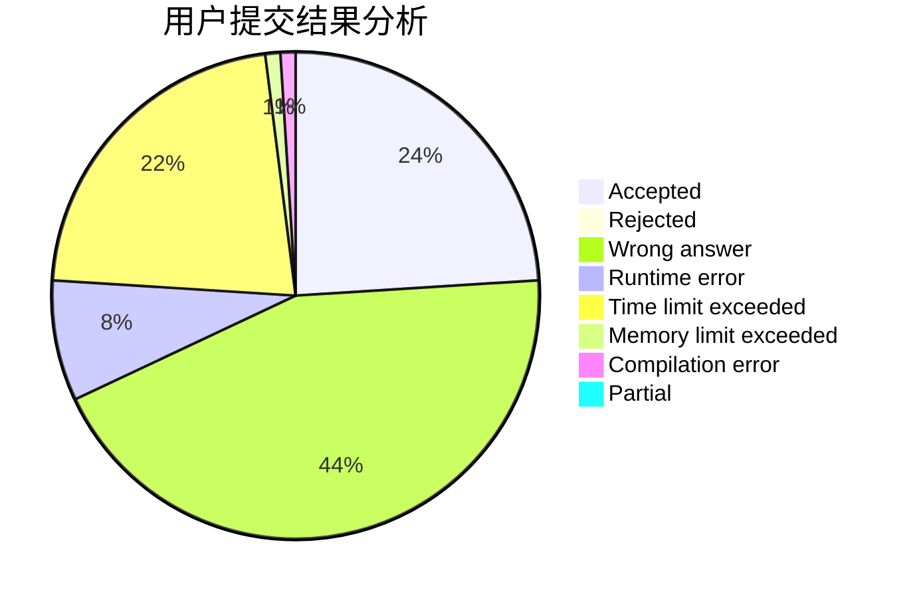
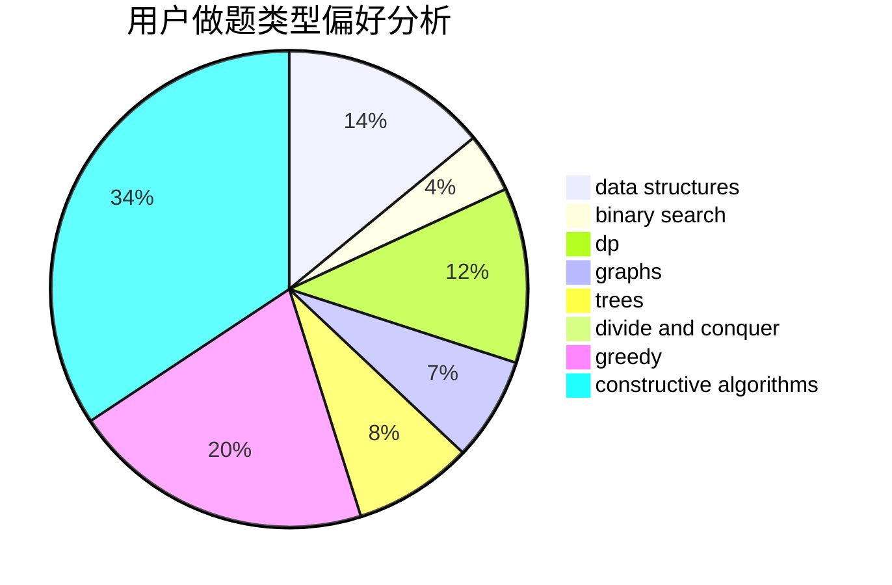
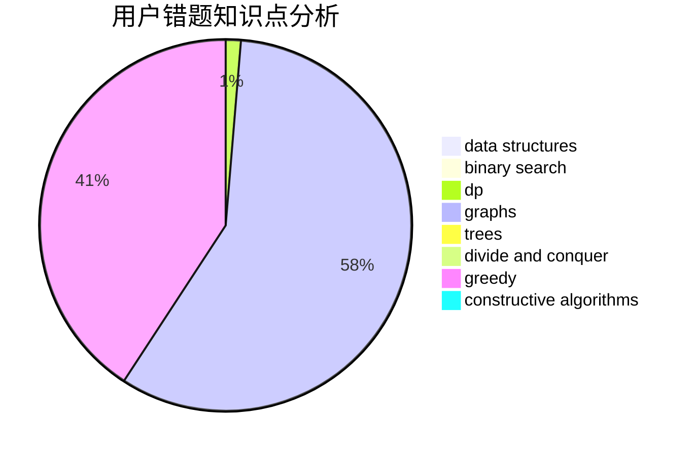

# colazcy

<!-- tabs:start -->

#### **用户提交结果分析**

#### **用户做题类型偏好分析**

#### **用户错题知识点分析**

<!-- tabs:end -->
# 推荐题目
[965E](https://codeforces.com/contest/965/problem/E)		data structures,
                        dp,
                        greedy,
                        strings,
                        trees		  
[900B](https://codeforces.com/contest/900/problem/B)		math,
                        number theory		  
[715C](https://codeforces.com/contest/715/problem/C)		dfs and similar,
                        divide and conquer,
                        dsu,
                        trees		  
[681A](https://codeforces.com/contest/681/problem/A)		implementation		  
[451D](https://codeforces.com/contest/451/problem/D)		math		  
[98D](https://codeforces.com/contest/98/problem/D)		constructive algorithms		  
[835C](https://codeforces.com/contest/835/problem/C)		dp,
                        implementation		  
[358D](https://codeforces.com/contest/358/problem/D)		dp,
                        greedy		  
[1011B](https://codeforces.com/contest/1011/problem/B)		binary search,
                        brute force,
                        implementation		  
[271D](https://codeforces.com/contest/271/problem/D)		data structures,
                        strings		  
