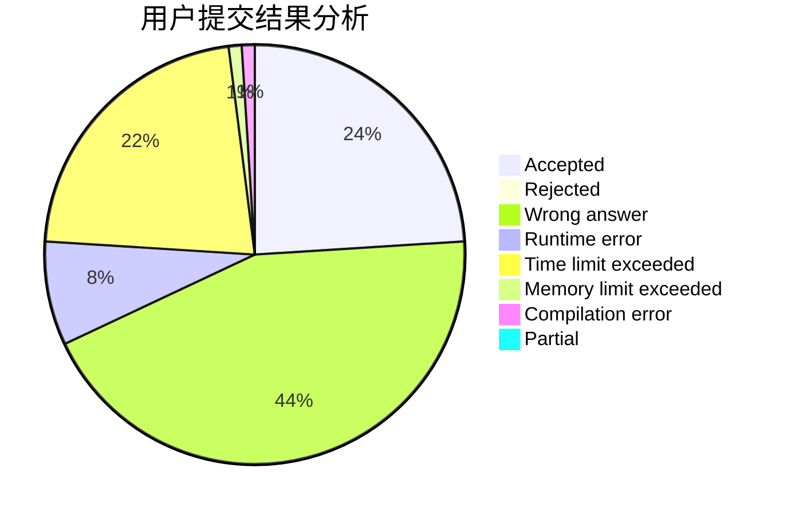
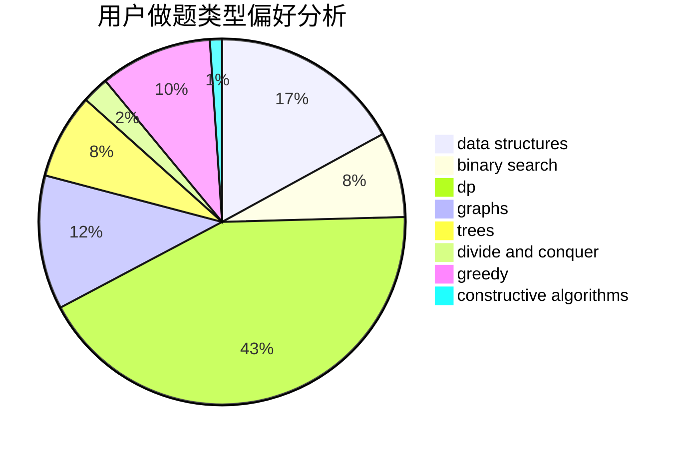
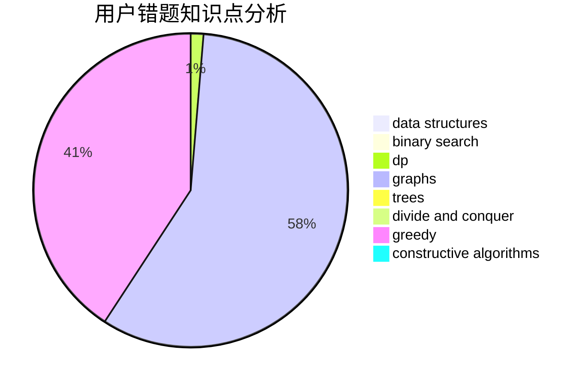

# colazcy

<!-- tabs:start -->

#### **用户提交结果分析**

#### **用户做题类型偏好分析**

#### **用户错题知识点分析**

<!-- tabs:end -->
# 推荐题目
[949A](https://codeforces.com/contest/949/problem/A)		greedy		  
[883C](https://codeforces.com/contest/883/problem/C)		binary search,
                        implementation		  
[698F](https://codeforces.com/contest/698/problem/F)		combinatorics,
                        number theory		  
[660C](https://codeforces.com/contest/660/problem/C)		binary search,
                        dp,
                        two pointers		  
[42A](https://codeforces.com/contest/42/problem/A)		greedy,
                        implementation		  
[975E](https://codeforces.com/contest/975/problem/E)		geometry		  
[816B](https://codeforces.com/contest/816/problem/B)		binary search,
                        data structures,
                        implementation		  
[32B](https://codeforces.com/contest/32/problem/B)		expression parsing,
                        implementation		  
[1010E](https://codeforces.com/contest/1010/problem/E)		data structures		  
[253D](https://codeforces.com/contest/253/problem/D)		brute force,
                        two pointers		  
