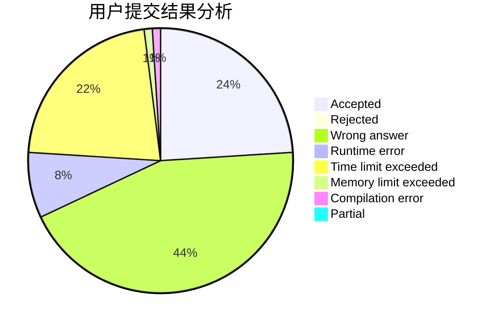
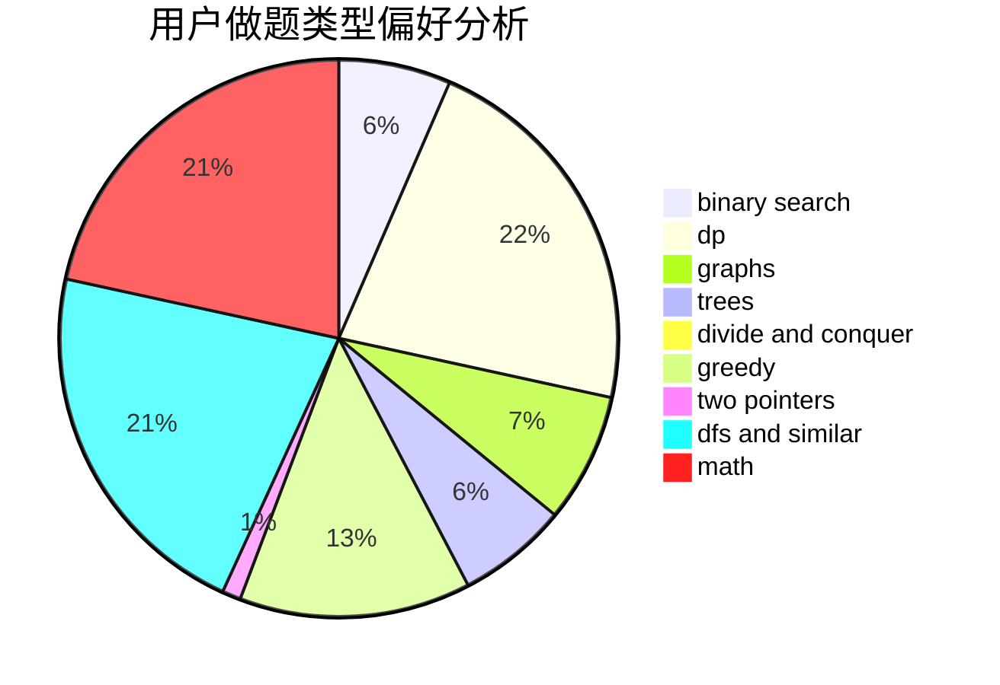

# colazcy

<!-- tabs:start -->

#### **用户提交结果分析**

#### **用户做题类型偏好分析**

<!-- tabs:end -->
# 推荐题目
[965E](https://codeforces.com/contest/965/problem/E)
[900B](https://codeforces.com/contest/900/problem/B)
[715C](https://codeforces.com/contest/715/problem/C)
[681A](https://codeforces.com/contest/681/problem/A)
[451D](https://codeforces.com/contest/451/problem/D)
[98D](https://codeforces.com/contest/98/problem/D)
[835C](https://codeforces.com/contest/835/problem/C)
[358D](https://codeforces.com/contest/358/problem/D)
[1011B](https://codeforces.com/contest/1011/problem/B)
[271D](https://codeforces.com/contest/271/problem/D)
