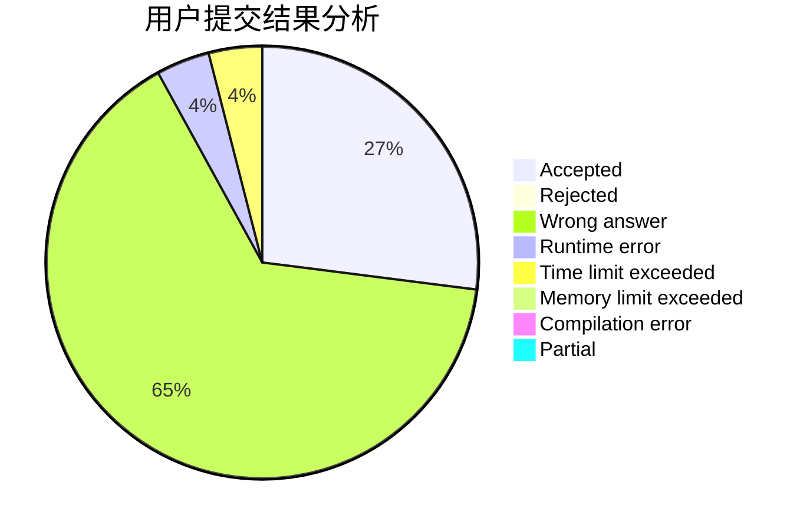
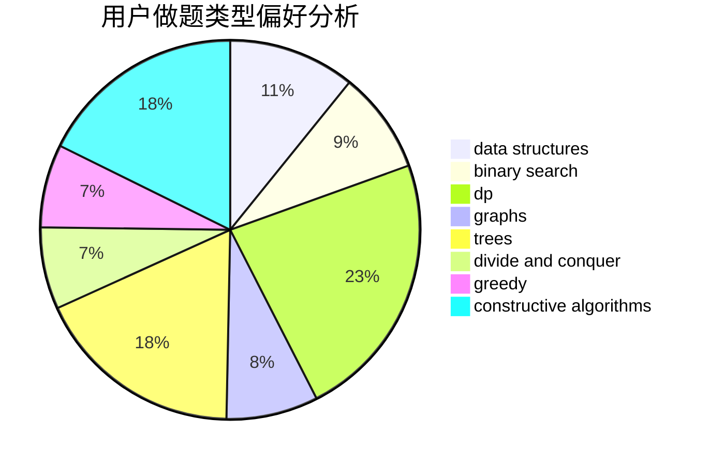
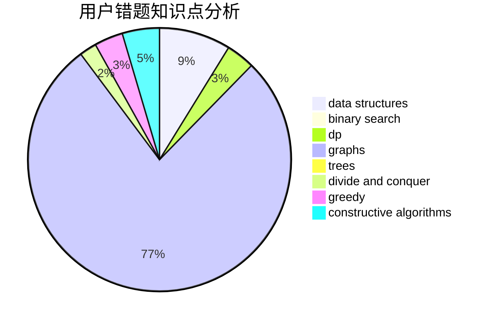

# comld

<!-- tabs:start -->

#### **用户提交结果分析**

#### **用户做题类型偏好分析**

#### **用户错题知识点分析**

<!-- tabs:end -->
# 推荐题目
[933B](https://codeforces.com/contest/933/problem/B)		math		  
[869E](https://codeforces.com/contest/869/problem/E)		data structures,
                        hashing		  
[1068C](https://codeforces.com/contest/1068/problem/C)		constructive algorithms,
                        graphs		  
[1504E](https://codeforces.com/contest/1504/problem/E)		dsu,graphs,sortings,trees		  
[580C](https://codeforces.com/contest/580/problem/C)		dfs and similar,
                        graphs,
                        trees		  
[575G](https://codeforces.com/contest/575/problem/G)		dfs and similar,
                        shortest paths		  
[710B](https://codeforces.com/contest/710/problem/B)		brute force,
                        sortings		  
[1040B](https://codeforces.com/contest/1040/problem/B)		dp,
                        greedy,
                        math		  
[489A](https://codeforces.com/contest/489/problem/A)		greedy,
                        implementation,
                        sortings		  
[1136E](https://codeforces.com/contest/1136/problem/E)		binary search,
                        data structures		  
