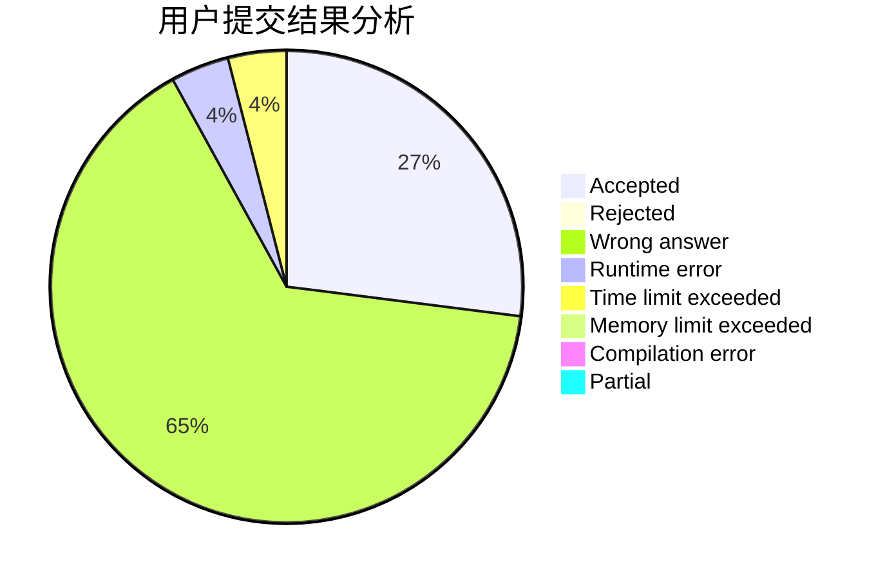
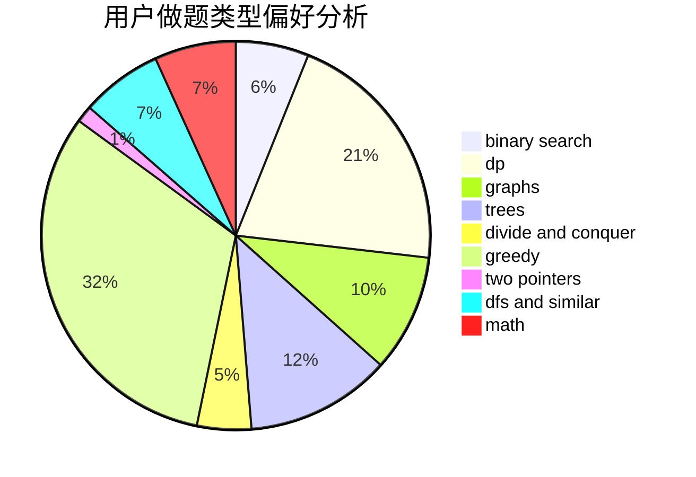

# comld

<!-- tabs:start -->

#### **用户提交结果分析**

#### **用户做题类型偏好分析**

<!-- tabs:end -->
# 推荐题目
[933B](https://codeforces.com/contest/933/problem/B)
[869E](https://codeforces.com/contest/869/problem/E)
[1068C](https://codeforces.com/contest/1068/problem/C)
[1504E](https://codeforces.com/contest/1504/problem/E)
[580C](https://codeforces.com/contest/580/problem/C)
[575G](https://codeforces.com/contest/575/problem/G)
[710B](https://codeforces.com/contest/710/problem/B)
[1040B](https://codeforces.com/contest/1040/problem/B)
[489A](https://codeforces.com/contest/489/problem/A)
[1136E](https://codeforces.com/contest/1136/problem/E)
