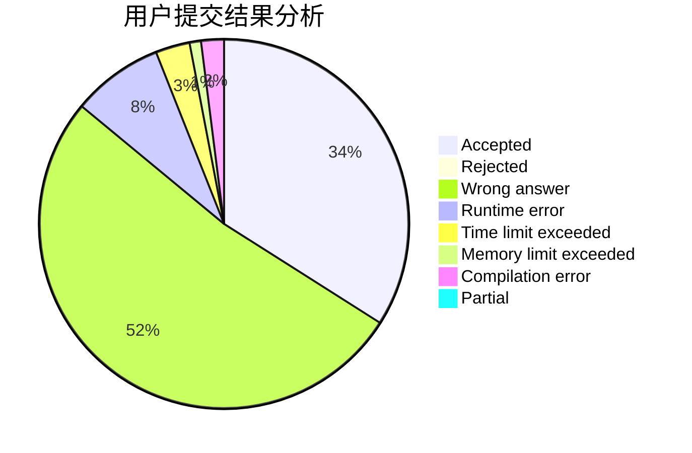
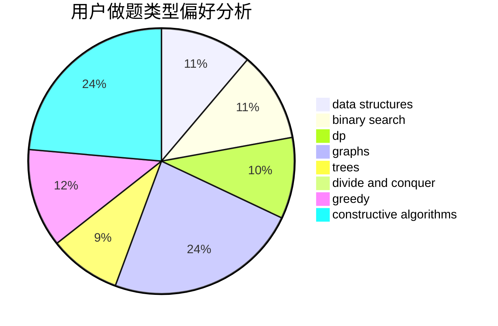
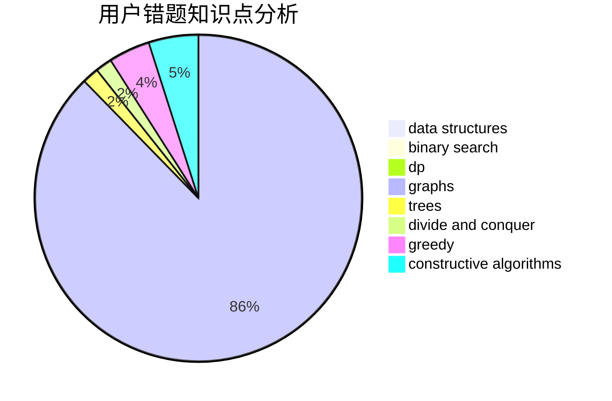

# command_block

<!-- tabs:start -->

#### **用户提交结果分析**

#### **用户做题类型偏好分析**

#### **用户错题知识点分析**

<!-- tabs:end -->
# 推荐题目
[1300E](https://codeforces.com/contest/1300/problem/E)		dsu,graphs,sortings,trees		  
[325B](https://codeforces.com/contest/325/problem/B)		binary search,
                        math		  
[12492](https://codeforces.com/contest/1249/problem/2)		dsu,graphs,sortings,trees		  
[466E](https://codeforces.com/contest/466/problem/E)		dfs and similar,
                        dsu,
                        graphs,
                        trees		  
[1335B](https://codeforces.com/contest/1335/problem/B)		constructive algorithms		  
[325D](https://codeforces.com/contest/325/problem/D)		dsu		  
[827B](https://codeforces.com/contest/827/problem/B)		constructive algorithms,
                        greedy,
                        implementation,
                        trees		  
[67B](https://codeforces.com/contest/67/problem/B)		greedy		  
[11961](https://codeforces.com/contest/1196/problem/1)		dsu,graphs,sortings,trees		  
[439C](https://codeforces.com/contest/439/problem/C)		brute force,
                        constructive algorithms,
                        implementation,
                        number theory		  
