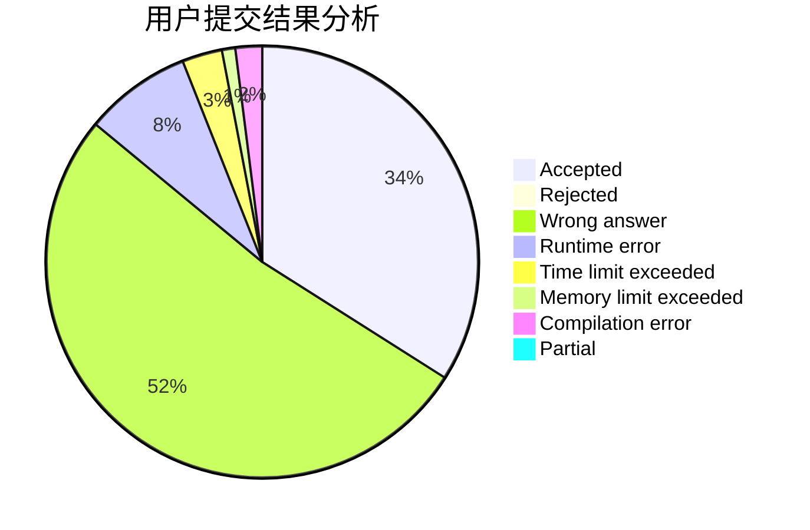
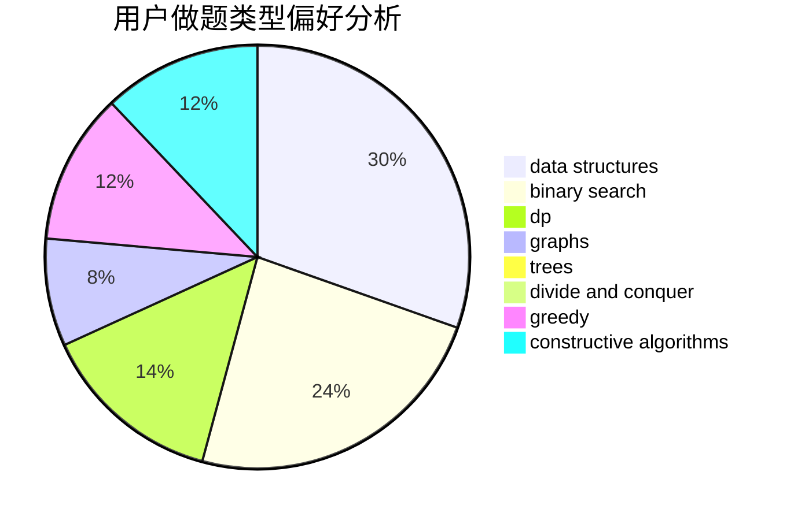
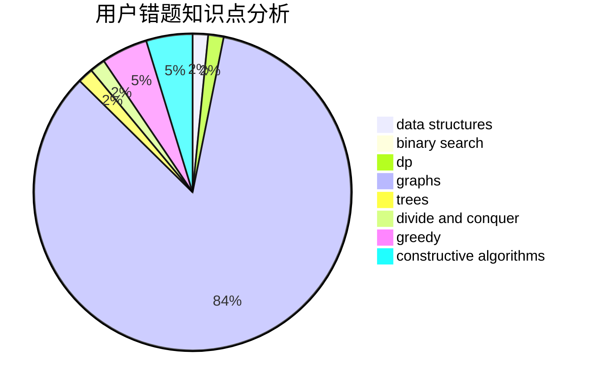

# command_block

<!-- tabs:start -->

#### **用户提交结果分析**

#### **用户做题类型偏好分析**

#### **用户错题知识点分析**

<!-- tabs:end -->
# 推荐题目
[1294C](https://codeforces.com/contest/1294/problem/C)		greedy,
                        math,
                        number theory		  
[304D](https://codeforces.com/contest/304/problem/D)		dsu,graphs,sortings,trees		  
[1244A](https://codeforces.com/contest/1244/problem/A)		math		  
[446D](https://codeforces.com/contest/446/problem/D)		math,
                        matrices,
                        probabilities		  
[1329B](https://codeforces.com/contest/1329/problem/B)		bitmasks,
                        combinatorics,
                        math		  
[305B](https://codeforces.com/contest/305/problem/B)		brute force,
                        implementation,
                        math		  
[809C](https://codeforces.com/contest/809/problem/C)		combinatorics,
                        divide and conquer,
                        dp		  
[659G](https://codeforces.com/contest/659/problem/G)		combinatorics,
                        dp,
                        number theory		  
[1190A](https://codeforces.com/contest/1190/problem/A)		implementation,
                        two pointers		  
[413E](https://codeforces.com/contest/413/problem/E)		data structures,
                        divide and conquer		  
