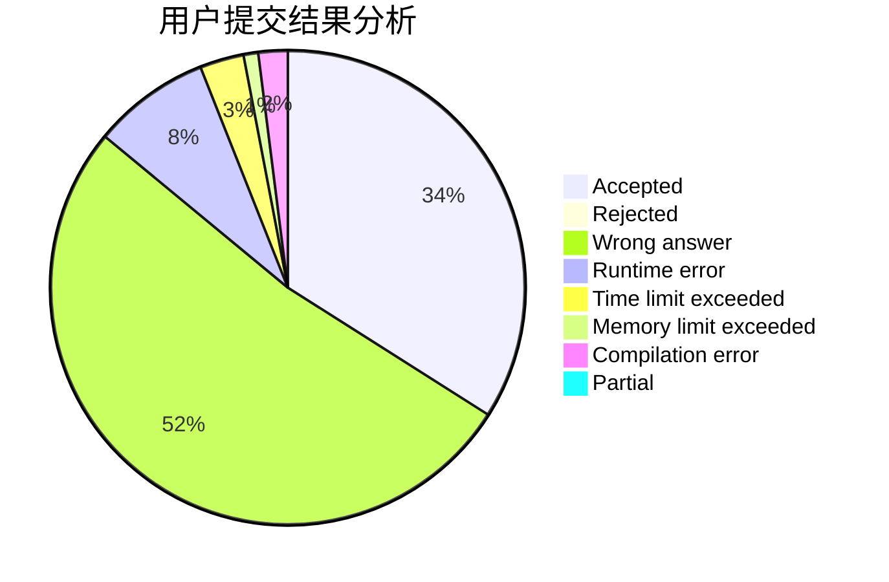
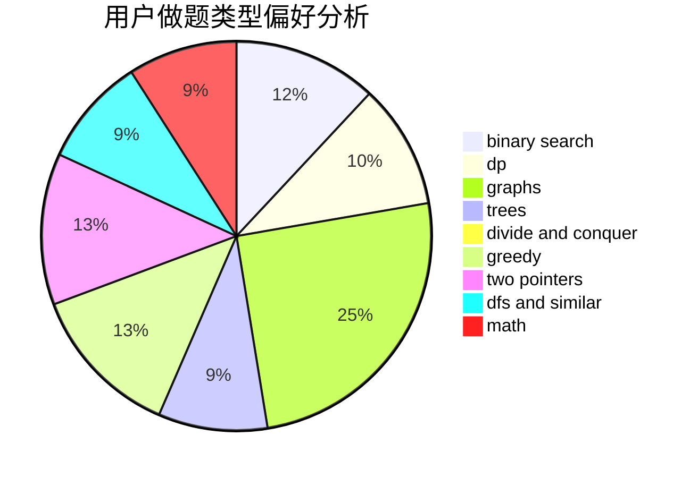

# command_block

<!-- tabs:start -->

#### **用户提交结果分析**

#### **用户做题类型偏好分析**

<!-- tabs:end -->
# 推荐题目
[1300E](https://codeforces.com/contest/1300/problem/E)
[325B](https://codeforces.com/contest/325/problem/B)
[12492](https://codeforces.com/contest/1249/problem/2)
[466E](https://codeforces.com/contest/466/problem/E)
[1335B](https://codeforces.com/contest/1335/problem/B)
[325D](https://codeforces.com/contest/325/problem/D)
[827B](https://codeforces.com/contest/827/problem/B)
[67B](https://codeforces.com/contest/67/problem/B)
[11961](https://codeforces.com/contest/1196/problem/1)
[439C](https://codeforces.com/contest/439/problem/C)
