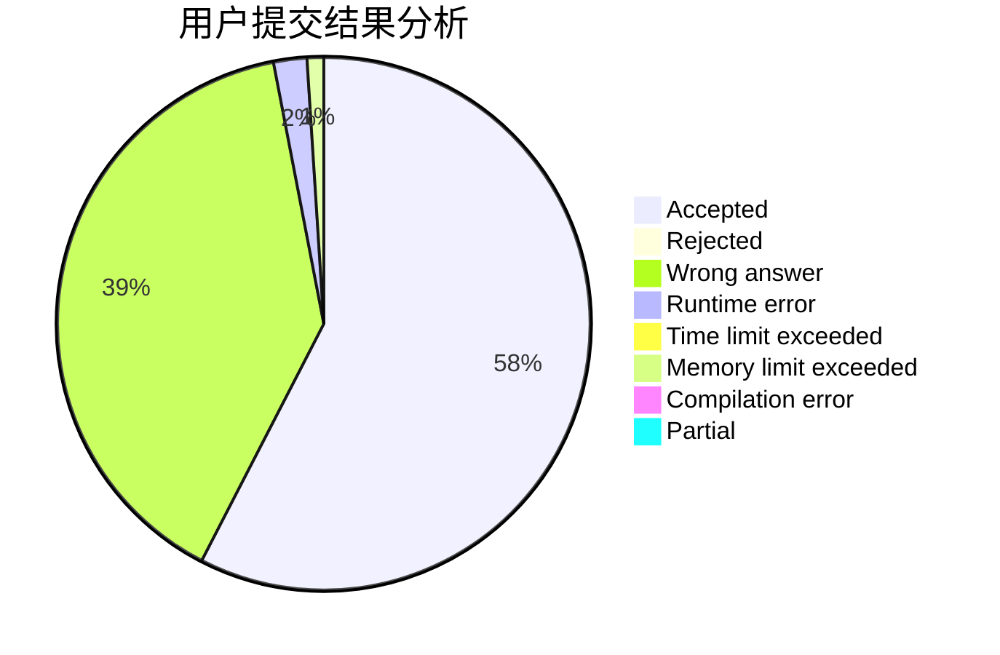
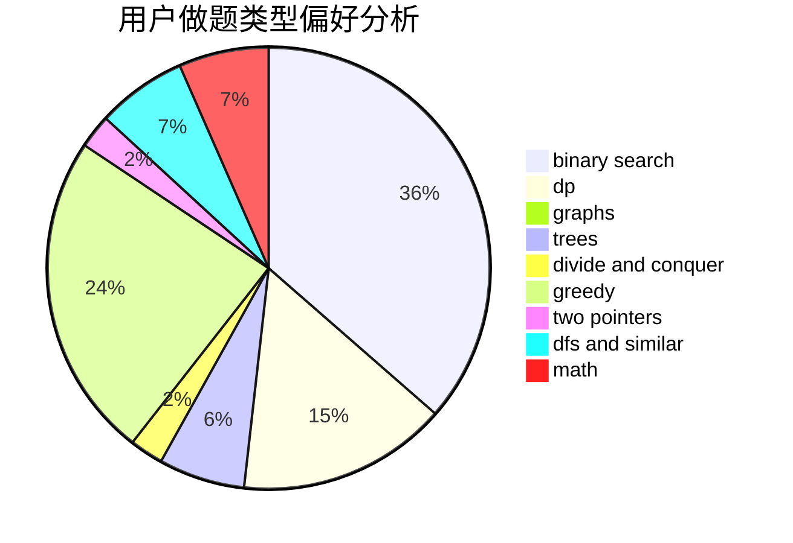

# compute

<!-- tabs:start -->

#### **用户提交结果分析**

#### **用户做题类型偏好分析**

<!-- tabs:end -->
# 推荐题目
[1033F](https://codeforces.com/contest/1033/problem/F)
[889E](https://codeforces.com/contest/889/problem/E)
[152E](https://codeforces.com/contest/152/problem/E)
[1225C](https://codeforces.com/contest/1225/problem/C)
[292D](https://codeforces.com/contest/292/problem/D)
[862A](https://codeforces.com/contest/862/problem/A)
[41A](https://codeforces.com/contest/41/problem/A)
[1320E](https://codeforces.com/contest/1320/problem/E)
[85D](https://codeforces.com/contest/85/problem/D)
[1175F](https://codeforces.com/contest/1175/problem/F)
