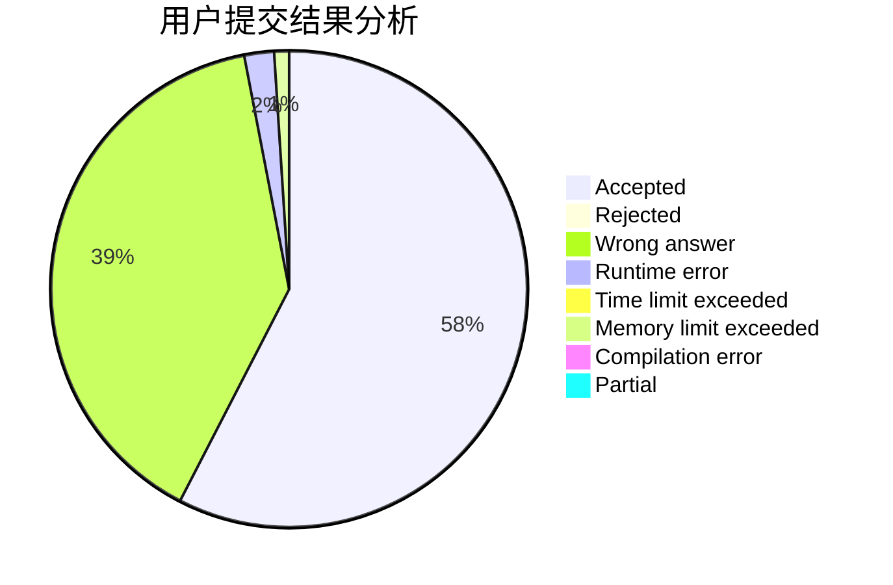
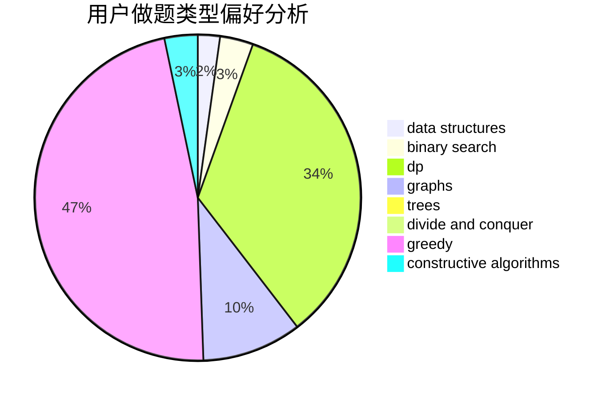

# compute

<!-- tabs:start -->

#### **用户提交结果分析**

#### **用户做题类型偏好分析**

#### **用户错题知识点分析**

<!-- tabs:end -->
# 推荐题目
[1033C](https://codeforces.com/contest/1033/problem/C)		brute force,
                        dp,
                        games		  
[86B](https://codeforces.com/contest/86/problem/B)		constructive algorithms,
                        graph matchings,
                        greedy,
                        math		  
[1505D](https://codeforces.com/contest/1505/problem/D)		number theory		  
[1217E](https://codeforces.com/contest/1217/problem/E)		data structures,
                        greedy,
                        implementation,
                        math		  
[277C](https://codeforces.com/contest/277/problem/C)		games,
                        implementation		  
[842E](https://codeforces.com/contest/842/problem/E)		binary search,
                        dfs and similar,
                        divide and conquer,
                        graphs,
                        trees		  
[38B](https://codeforces.com/contest/38/problem/B)		brute force,
                        implementation,
                        math		  
[1311D](https://codeforces.com/contest/1311/problem/D)		brute force,
                        math		  
[840D](https://codeforces.com/contest/840/problem/D)		data structures,
                        probabilities		  
[1173C](https://codeforces.com/contest/1173/problem/C)		dsu,graphs,sortings,trees		  
