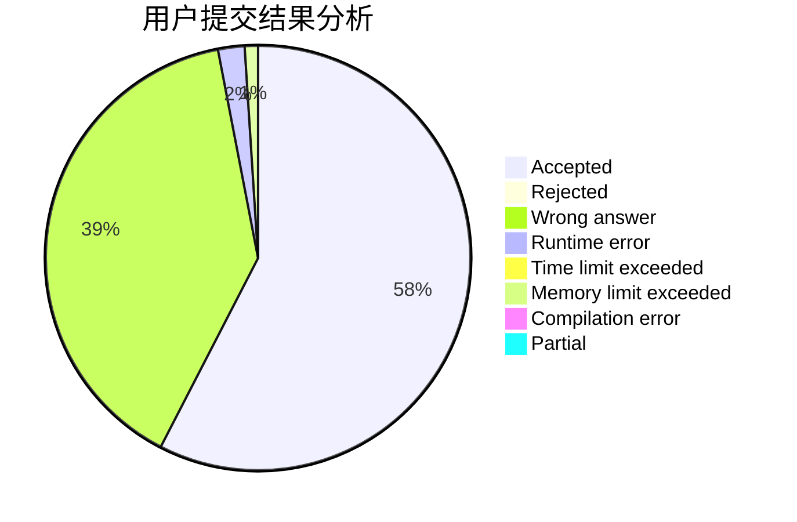
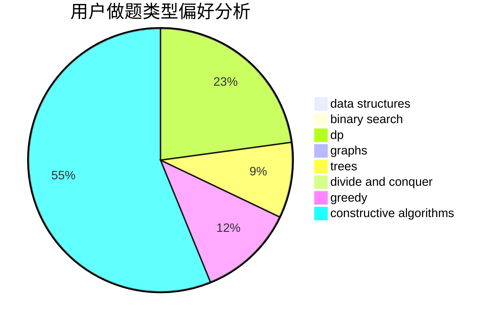
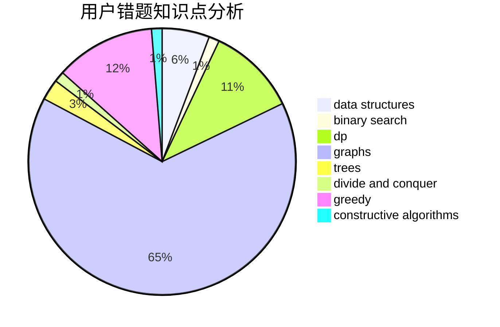

# compute

<!-- tabs:start -->

#### **用户提交结果分析**

#### **用户做题类型偏好分析**

#### **用户错题知识点分析**

<!-- tabs:end -->
# 推荐题目
[1033F](https://codeforces.com/contest/1033/problem/F)		bitmasks,
                        brute force,
                        fft,
                        math		  
[889E](https://codeforces.com/contest/889/problem/E)		binary search,
                        dp,
                        math		  
[152E](https://codeforces.com/contest/152/problem/E)		bitmasks,
                        dp,
                        graphs,
                        trees		  
[1225C](https://codeforces.com/contest/1225/problem/C)		bitmasks,
                        brute force,
                        math		  
[292D](https://codeforces.com/contest/292/problem/D)		data structures,
                        dfs and similar,
                        dp,
                        dsu		  
[862A](https://codeforces.com/contest/862/problem/A)		greedy,
                        implementation		  
[41A](https://codeforces.com/contest/41/problem/A)		implementation,
                        strings		  
[1320E](https://codeforces.com/contest/1320/problem/E)		data structures,
                        dfs and similar,
                        dp,
                        shortest paths,
                        trees		  
[85D](https://codeforces.com/contest/85/problem/D)		binary search,
                        brute force,
                        data structures,
                        implementation		  
[1175F](https://codeforces.com/contest/1175/problem/F)		brute force,
                        data structures,
                        divide and conquer,
                        hashing,
                        math		  
