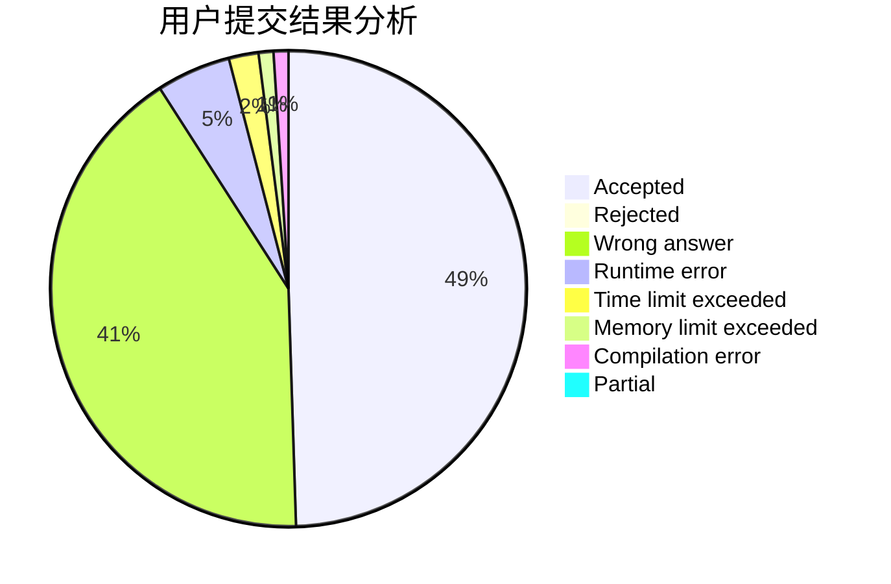
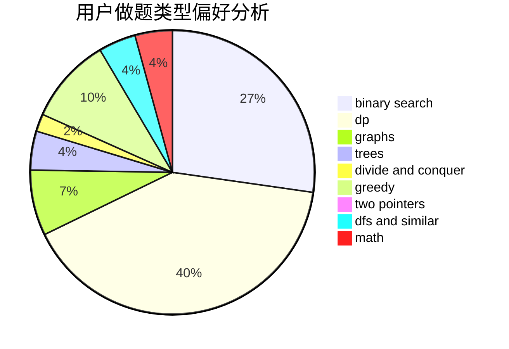

# comzyh

<!-- tabs:start -->

#### **用户提交结果分析**

#### **用户做题类型偏好分析**

<!-- tabs:end -->
# 推荐题目
[452E](https://codeforces.com/contest/452/problem/E)
[555E](https://codeforces.com/contest/555/problem/E)
[1384E](https://codeforces.com/contest/1384/problem/E)
[312A](https://codeforces.com/contest/312/problem/A)
[261B](https://codeforces.com/contest/261/problem/B)
[567B](https://codeforces.com/contest/567/problem/B)
[1009E](https://codeforces.com/contest/1009/problem/E)
[300E](https://codeforces.com/contest/300/problem/E)
[568B](https://codeforces.com/contest/568/problem/B)
[994A](https://codeforces.com/contest/994/problem/A)
